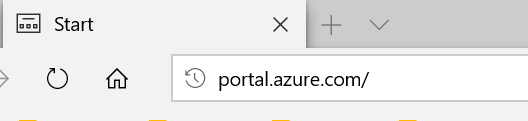
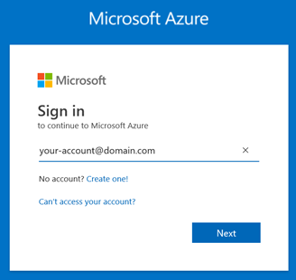
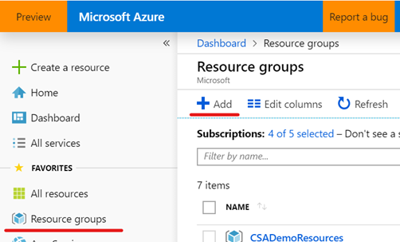
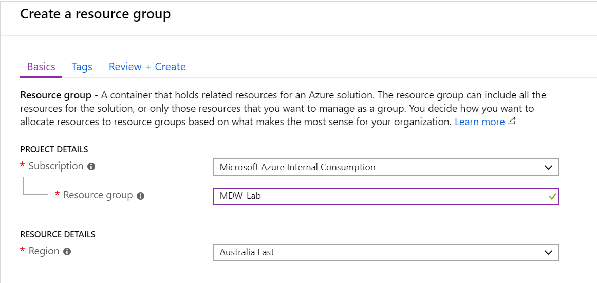

# Deploy Azure Data Platform End2End to your subscription

In this section you will automatically provision all Azure resources required to complete labs 1 though to 5. We will use a pre-defined ARM template with the definition of all Azure services used to ingest, store, process and visualise data. 

The estimated time to complete this lab is: 30 minutes.

## Prepare your Azure subscription
In this section you will use the Azure Portal to create a Resource Group that will host the Azure Data Services used in labs 1 through to 5.

**IMPORTANT**|
-------------|
**Execute these steps on your host computer**|

1.	Open the browser and navigate to https://portal.azure.com

    

2.	Log on to Azure using your account credentials

    

3.	Once you have successfully logged on, locate the **Favourites** menu on the left-hand side panel and click the **Resource groups** item to open the **Resource groups** blade.

4.	On the **Resource groups** blade, click the **+ Add** button to create a new resource group.

    

5.	On the **Create a resource group** blade, select your subscription in **Subscription** drop down list.

6.	In the Resource group text box enter “MDW-Lab”

    **IMPORTANT**: If you are deploying this workshop to multiple students using the same subscription then add the student alias to the resources group name so they can identify their own set of resources and avoid confusion during the labs. Example: "MDW-Lab-*Student01*"

    **IMPORTANT**: The name of the resource group chosen is *not* relevant to the successful completion of the labs. If you choose to use a different name, then please proceed with the rest of the lab using your unique name for the resource group.

    

--------------------------------------

You must deploy all Azure services required in each lab by clicking the **Deploy to Azure** button above. Follow the instructions on the screen and provide:
     - The subscription you want to use
     - The resource group  

-	The ARM template used to automate the deployment of Azure services attempts to deploy all services required in the resource group default region. See more information on Lab 0.
