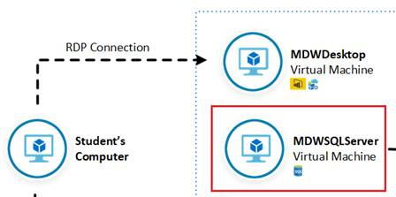
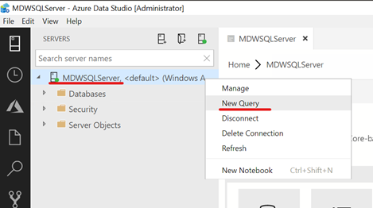

# Lab 1: Load Data into Azure SQL Data Warehouse using Azure Data Factory Pipelines
In this lab you will configure the Azure environment to allow relational data to be transferred from a SQL Server 2017 database to an Azure SQL Data Warehouse database using Azure Data Factory. The dataset you will use contains data about motor vehicle collisions that happened in New Your City from 2012 to 2019. You will use Power BI to visualise collision data loaded from Azure SQL Data Warehouse.
## Lab Architecture


Step     | Description
-------- | -----
 | Restore SQL Server backup from Azure Storage and Configure Azure Data Factory Self-Hosted Integration Runtime
 | Build an Azure Data Factory Pipeline to copy data from a SQL Server table
 | Use Azure Storage as a staging area for Polybase
 | Load data to an Azure SQL Data Warehouse table using Polybase
 | Visualize data from Azure SQL Data Warehouse using Power BI

**IMPORTANT**: Some of the Azure services provisioned by Lab0 require globally unique name and a “-suffix” has been added to their names to ensure this uniqueness. Please take note of the suffix generated as you will need it for the following resources:

Name	                     |Type
-----------------------------|--------------------
mdwcosmosdb-*suffix*	     |Cosmos DB account
MDWDataFactory-*suffix*	     |Data Factory (V2)
mdwdatalake*suffix*	         |Storage Account
MDWEventHubs-*suffix*	     |Event Hubs Namespace
MDWKeyVault-*suffix*	     |Key vault
mdwsqlvirtualserver-*suffix* |SQL server
MDWStreamAnalytics-*suffix*	 |Stream Analytics job

## Connect to MDWDesktop
In this section you are going to establish a Remote Desktop Connection to MDWDesktop virtual machine.

**IMPORTANT**|
-------------|
**Execute these steps on your host computer**|

1.	In the Azure Portal, navigate to the MDW-Lab resource group and click the MDWDesktop virtual machine.
2.	On the MDWDesktop blade, from the Overview menu, click the Connect button. 


3.	On the Connect to virtual machine blade, click Download RDP File. This will download a .rdp file that you can use to establish a Remote Desktop Connection with the virtual machine.


## Install required software onto MDWDesktop
In this section you are going to install Power BI Desktop and Azure Data Studio on MDWDesktop.


**IMPORTANT**|
-------------|
**Execute these steps inside the MDWDesktop remote desktop connection**|

1.	Once the RDP file is downloaded, click on it to establish an RDP connection with MDWDesktop
2.	User the following credentials to authenticate:
    <br>- **User Name**: MDWAdmin
    <br>- **Password**: P@ssw0rd123!
3.	Once logged in, accept the default privacy settings.
4.	Using the browser, download and install the latest version of following software. During the setup, accept all default settings:
    <br>
    <br>- **Azure Data Studio (User Installer)**
    <br>https://docs.microsoft.com/en-us/sql/azure-data-studio/download
    <br>
    <br>
    <br>**Power BI Desktop (64-bit)**
    <br>https://www.microsoft.com/en-us/download/details.aspx?id=45331
    <br>

## Restore NYCDataSets database onto MDWSQLServer
In this section you are going to connect to MDWSQLServer to restore the NYCDataSets database from backup stored in the MDWResources storage Account.



**IMPORTANT**|
-------------|
**Execute these steps inside the MDWDesktop remote desktop connection**|

1.	Open Azure Data Studio and establish a new connection to MDWSQLServer using Windows Authentication


2.	Press Ctrl+G to expand the Servers panel
3.	Right-click the MDWSQLServer server name on the SERVERS panel and select New Query



4.	On the Query Editor window, create a new credential named [https://mdwresources.blob.core.windows.net/nycdatasets] using a Shared Access Signature (SAS). Use this SQL command:

```sql
create credential [https://mdwresources.blob.core.windows.net/nycdatasets] 
   with identity = 'SHARED ACCESS SIGNATURE',  
   secret = 'sv=2018-03-28&ss=b&srt=sco&sp=rwl&se=2050-12-30T17:25:52Z&st=2019-04-05T09:25:52Z&spr=https&sig=4qrD8NmhaSmRFu2gKja67ayohfIDEQH3LdVMa2Utykc%3D'
go
```

5.	Restore the NYCDataSets database from the backup file stored in the Azure Storage Account. The backup file name is NYCDataSets.Full.bak. The restore command should move the data file to the ‘F:\Data’ folder and the log file to the ‘F:\Log’ folder. Use this SQL command:

```sql
restore database NYCDataSets from url = 'https://mdwresources.blob.core.windows.net/nycdatasets/NYCDataSets.Full.bak'
   with move 'NYCDataSets' to 'F:\Data\NYCDataSets.mdf'
      , move 'NYCDataSets_log' to 'F:\Log\NYCDataSets_log.ldf'
go
```

6.	The full solution script can be found 

[I'm a relative reference to a repository file](./Solution/Restore NYCDataSets.sql)

