# Lab 1: Load Data into Azure SQL Data Warehouse using Azure Data Factory Pipelines
In this lab you will configure the Azure environment to allow relational data to be transferred from a SQL Server 2017 database to an Azure SQL Data Warehouse database using Azure Data Factory. The dataset you will use contains data about motor vehicle collisions that happened in New Your City from 2012 to 2019. You will use Power BI to visualise collision data loaded from Azure SQL Data Warehouse.

The estimated time to complete this lab is: **60 minutes**.

## Lab Architecture


Step     | Description
-------- | -----
 | Restore SQL Server backup from Azure Storage and Configure Azure Data Factory Self-Hosted Integration Runtime
 | Build an Azure Data Factory Pipeline to copy data from a SQL Server table
 | Use Azure Storage as a staging area for Polybase
 | Load data to an Azure SQL Data Warehouse table using Polybase
 | Visualize data from Azure SQL Data Warehouse using Power BI

**IMPORTANT**: Some of the Azure services provisioned require globally unique name and a “-suffix” has been added to their names to ensure this uniqueness. Please take note of the suffix generated as you will need it for the following resources:

Name	                     |Type
-----------------------------|--------------------
mdwcosmosdb-*suffix*	     |Cosmos DB account
MDWDataFactory-*suffix*	     |Data Factory (V2)
mdwdatalake*suffix*	         |Storage Account
MDWEventHubs-*suffix*	     |Event Hubs Namespace
MDWKeyVault-*suffix*	     |Key vault
mdwsqlvirtualserver-*suffix* |SQL server
MDWStreamAnalytics-*suffix*	 |Stream Analytics job

## Connect to MDWDesktop
In this section you are going to establish a Remote Desktop Connection to MDWDesktop virtual machine.

**IMPORTANT**|
-------------|
**Execute these steps on your host computer**|

1.	In the Azure Portal, navigate to the **MDW-Lab** resource group and click the **MDWDesktop** virtual machine.

2.	On the MDWDesktop blade, from the Overview menu, click the Connect button. 

    

3.	On the **Connect to virtual machine** blade, click **Download RDP File**. This will download a .rdp file that you can use to establish a Remote Desktop Connection with the virtual machine.

    

## Install required software onto MDWDesktop
In this section you are going to install Power BI Desktop and Azure Data Studio on MDWDesktop.

    

**IMPORTANT**|
-------------|
**Execute these steps inside the MDWDesktop remote desktop connection**|

1.	Once the RDP file is downloaded, click on it to establish an RDP connection with MDWDesktop

2.	User the following credentials to authenticate:
    <br>- **User Name**: MDWAdmin
    <br>- **Password**: P@ssw0rd123!
3.	Once logged in, accept the default privacy settings.

4.	Using the browser, download and install the latest version of following software. During the setup, accept all default settings:
    <br>
    <br>- **Azure Data Studio (User Installer)**
    <br>https://docs.microsoft.com/en-us/sql/azure-data-studio/download
    <br>
    <br>
    <br>**Power BI Desktop (64-bit)**
    <br>https://www.microsoft.com/en-us/download/details.aspx?id=45331
    <br>

## Restore NYCDataSets database onto MDWSQLServer
In this section you are going to connect to MDWSQLServer to restore the NYCDataSets database from backup stored in the MDWResources storage Account.


**IMPORTANT**|
-------------|
**Execute these steps inside the MDWDesktop remote desktop connection**|

1.	Open Azure Data Studio and establish a new connection to MDWSQLServer using Windows Authentication

    

2.	Press **Ctrl+G** to expand the Servers panel

3.	Right-click the **MDWSQLServer** server name on the SERVERS panel and select **New Query**

    

4.	On the **Query Editor** window, create a new credential named [https://mdwresources.blob.core.windows.net/nycdatasets] using a Shared Access Signature (SAS). Use this SQL command:

```sql
create credential [https://mdwresources.blob.core.windows.net/nycdatasets] 
   with identity = 'SHARED ACCESS SIGNATURE',  
   secret = 'sv=2018-03-28&ss=b&srt=sco&sp=rwl&se=2050-12-30T17:25:52Z&st=2019-04-05T09:25:52Z&spr=https&sig=4qrD8NmhaSmRFu2gKja67ayohfIDEQH3LdVMa2Utykc%3D'
go
```

5.	Restore the NYCDataSets database from the backup file stored in the Azure Storage Account. The backup file name is NYCDataSets.Full.bak. The restore command should move the data file to the ‘F:\Data’ folder and the log file to the ‘F:\Log’ folder. Use this SQL command:

```sql
restore database NYCDataSets from url = 'https://mdwresources.blob.core.windows.net/nycdatasets/NYCDataSets.Full.bak'
   with move 'NYCDataSets' to 'F:\Data\NYCDataSets.mdf'
      , move 'NYCDataSets_log' to 'F:\Log\NYCDataSets_log.ldf'
go
```

## Create Azure SQL Data Warehouse database objects
In this section you will connect to Azure SQL Data Warehouse to create the database objects used to host and process data.

    

**IMPORTANT**|
-------------|
**Execute these steps inside the MDWDesktop remote desktop connection**|

1.	Open Azure Data Studio. On the Servers panel, click **New Connection**.

    

2.	On the **Connection Details** panel, enter the following connection details:
    <br> - **Server**: mdwsqlvirtualserver-suffix.database.windows.net
    <br>- **Authentication Type**: SQL Login
    <br>- **User Name**: mdwadmin
    <br>- **Password**: P@ssw0rd123!
    <br>- **Database**: MDWASQLDW

3.	Click **Connect**.

4.	Right-click the server name and click **New Query**.

    

5.	On the new query window, create a new database schema named [NYC]. Use this SQL Command:

```sql
create schema [NYC]
go
```

6.	Create a new round robin distributed table named NYC.NYPD_MotorVehicleCollisions, see column definitions on the SQL Command:

```sql
create table [NYC].[NYPD_MotorVehicleCollisions](
	[UniqueKey] [int] NULL,
	[CollisionDate] [date] NULL,
	[CollisionDayOfWeek] [varchar](9) NULL,
	[CollisionTime] [time](7) NULL,
	[CollisionTimeAMPM] [varchar](2) NOT NULL,
	[CollisionTimeBin] [varchar](11) NULL,
	[Borough] [varchar](200) NULL,
	[ZipCode] [varchar](20) NULL,
	[Latitude] [float] NULL,
	[Longitude] [float] NULL,
	[Location] [varchar](200) NULL,
	[OnStreetName] [varchar](200) NULL,
	[CrossStreetName] [varchar](200) NULL,
	[OffStreetName] [varchar](200) NULL,
	[NumberPersonsInjured] [int] NULL,
	[NumberPersonsKilled] [int] NULL,
	[IsFatalCollision] [int] NOT NULL,
	[NumberPedestriansInjured] [int] NULL,
	[NumberPedestriansKilled] [int] NULL,
	[NumberCyclistInjured] [int] NULL,
	[NumberCyclistKilled] [int] NULL,
	[NumberMotoristInjured] [int] NULL,
	[NumberMotoristKilled] [int] NULL,
	[ContributingFactorVehicle1] [varchar](200) NULL,
	[ContributingFactorVehicle2] [varchar](200) NULL,
	[ContributingFactorVehicle3] [varchar](200) NULL,
	[ContributingFactorVehicle4] [varchar](200) NULL,
	[ContributingFactorVehicle5] [varchar](200) NULL,
	[VehicleTypeCode1] [varchar](200) NULL,
	[VehicleTypeCode2] [varchar](200) NULL,
	[VehicleTypeCode3] [varchar](200) NULL,
	[VehicleTypeCode4] [varchar](200) NULL,
	[VehicleTypeCode5] [varchar](200) NULL
) 
with (distribution = round_robin)
go
```

## Configure the Azure Data Factory Self Hosted Integration Runtime 
In this section you are going to install and configure required software onto MDWDataGateway. 

**IMPORTANT**|
-------------|
**Execute these steps on your host computer**|

1.	In the Azure Portal, navigate to the MDW-Lab resource group and locate the Azure Data Factory **MDWDataFactory-*suffix***.

2.	On the **MDWDataFactory-*suffix*** blade, click the **Author & Monitor** button. The Azure Data Factory portal will open on a new browser tab.

    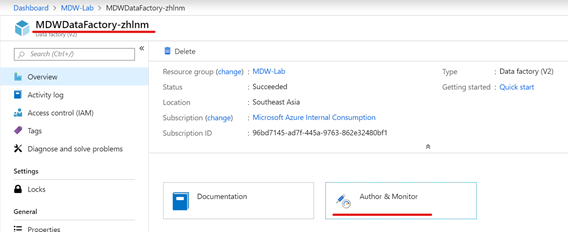

3.	On the **Azure Data Factory** portal, click the **Author *(pencil icon)*** button on the left-hand side menu. On the **Connections** tab, click **Integration Runtimes**.

4.	Click the **+ New** button to create a new Integration Runtime.

    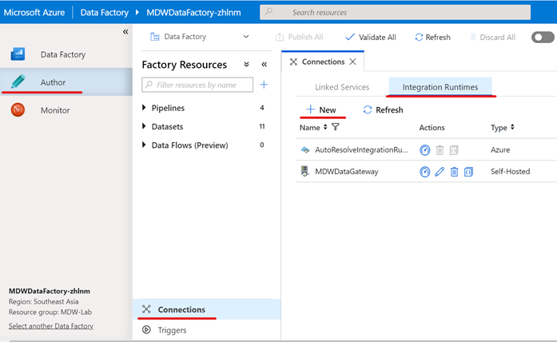

5.	On the **Integration Runtime Setup** blade, select **Perform data movement and dispatch activities to external computers** and click **Next**.

    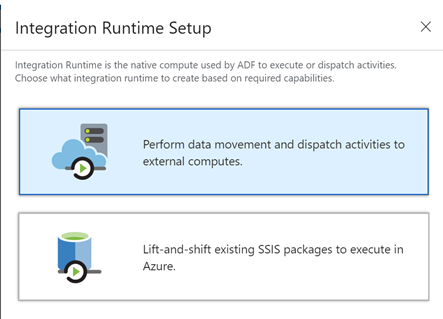

6.	When prompted to choose what network environment the integration runtime will connect to, select **Self-Hosted** and click **Next**.

    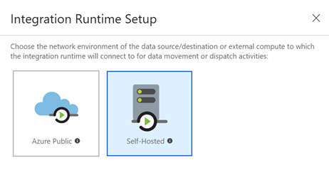

7.	Type MDWDataGateway in the **Name** text box and give it a meaningful description such as the example here. Click **Next**.

    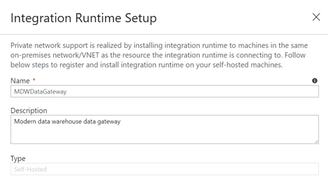

8.	Copy any of the generated **Authentication Key** keys (Key 1 or Key 2) to Notepad. You are going to need it in the next step.

9.	Click **Finish**.

    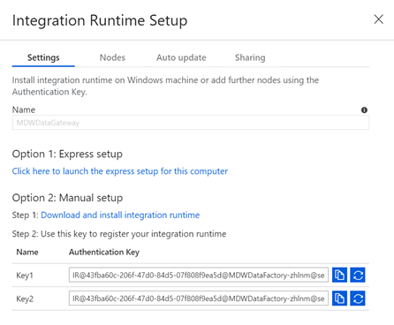

## Connect to MDWDataGateway and register the Self Hosted Integration Runtime with Azure Data Factory
In this section you are going to establish a Remote Desktop Connection to MDWDataGateway virtual machine.

    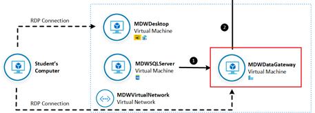

**IMPORTANT**|
-------------|
**Execute these steps on your host computer**|

1.	On the Azure Portal, navigate to the MDW-Lab resource group and locate the **MDWDataGateway** virtual machine.

2.	On the **MDWDataGateway** blade, from the **Overview** menu, click the **Connect** button. 

    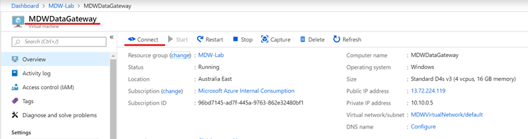

3.	On the **Connect to virtual machine** blade, click **Download RDP File**. This will download a .rdp file that you can use to establish a Remote Desktop Connection with the virtual machine.

    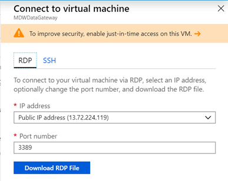

4.	Once the file is downloaded, click on file to establish the RDP connection with MDWDataGateway

5.	User the following credentials to authenticate:
    <br>- **User Name**: MDWAdmin
    <br>- **Password**: P@ssw0rd123!

**IMPORTANT**|
-------------|
**Execute these steps inside the MDWDataGateway remote desktop connection**|

1.	Once logged in, on the **Server Manager**, select **Local Server** on the left-hand side menu. On the right-hand side panel, locate the **IE Enhanced Security Configuration** and click the **On** link.

2.	Turn the setting **Off** for both **Administrators** and **Users**.

3.	Close **Server Manager**.

    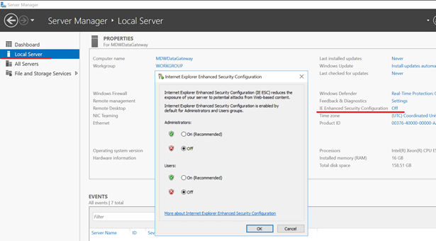

4.	Open the browser and download and execute the latest version of the Azure Data Factory Integration Runtime.

**Azure Data Factory Integration Runtime**
https://www.microsoft.com/en-ie/download/details.aspx?id=39717

5.	Accept all default options during the setup wizard. Once the setup if finished, the Microsoft Integration Runtime Configuration Manager will pop up asking you to enter a valid authentication key.

6.	Enter the authentication key generated in the previous exercise and click **Register**.

7.	Once registration is confirmed, click Finish. 

    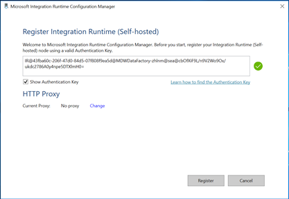

## Create Staging Container on Azure Blob Storage
In this section you create a staging container in your MDWDataLake that will be used as a staging environment for Polybase before data can be copied to Azure SQL Data Warehouse.

    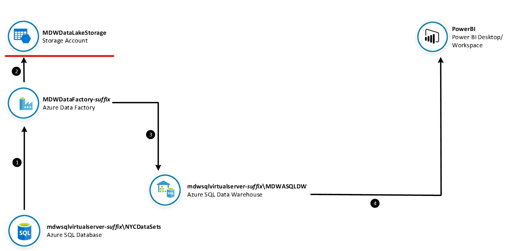

**IMPORTANT**|
-------------|
**Execute these steps on your host computer**|

1.	In the Azure Portal, go to the lab resource group and locate the Azure Storage account **mdwdatalake*suffix***. 

2.	On the **Overview** panel, click **Blobs**.

    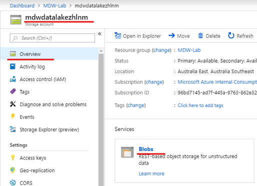

3.	On the **mdwdalalake*suffix* – Blobs** blade, click **+ Container**.

    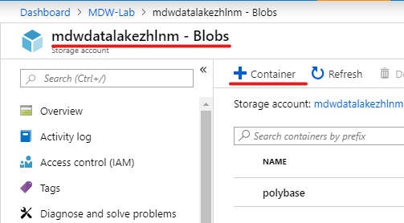

4.	On the **New container** blade, enter the following details:
    <br>- **Name**: polybase
    <br>- **Public access level**: Private (no anynymous access)

5.	Click **OK** to create the new container.

    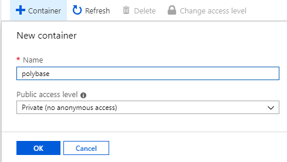

## Create Azure Data Factory Pipeline to Copy Relational Data
In this section you will build an Azure Data Factory pipeline to copy a table from MDWSQLServer to Azure SQL Data Warehouse.

    

### Create Linked Service connections

**IMPORTANT**|
-------------|
**Execute these steps on your host computer**|

1.	Open the **Azure Data Factory** portal and click the **Author *(pencil icon)*** option on the left-hand side panel. Under **Connections** tab, click **Linked Services** and then click **+ New** to create a new linked service connection.

    

2.	On the **New Linked Service** blade, type “SQL Server” in the search box to find the **SQL Server** linked service. Click **Continue**.

    

3.	On the **New Linked Service (SQL Server)** blade, enter the following details:
    <br>- **Name**: MDWSQLServer_NYCDataSets
    <br>- **Connect via integration runtime**: MDWDataGateway
    <br>- **Server Name**: MDWSQLServer
    <br>- **Database Name**: NYCDataSets
    <br>- **Authentication Type**: Windows Authentication
    <br>- **User Name**: MDWAdmin
    <br>- **Password**: P@ssw0rd123!

4.	Click **Test connection** to make sure you entered the correct connection details and then click **Finish**.

    

5.	Repeat the process to create an **Azure SQL Data Warehouse** linked service connection.

    

6.	On the New Linked Service (Azure SQL Data Warehouse) blade, enter the following details:
    <br>- **Name**: MDWVirtualSQLServer_MDWASQLDW
    <br>- **Connect via integration runtime**: AutoResolveIntegrationRuntime
    <br>- **Account selection method**: From Azure subscription
    <br>- **Azure subscription**: *<your subscription>*
    <br>- **Server Name**: mdwsqlvirtualserver-*suffix*
    <br>- **Database Name**: MDWASQLDW
    <br>- **Authentication** Type: SQL Authentication 
    <br>- **User** Name: MDWAdmin
    <br>- **Password**: P@ssw0rd123!
7.	Click **Test connection** to make sure you entered the correct connection details and then click **Finish**.

    

8.	Repeat the process once again to create an **Azure Blob Storage** linked service connection.

    

9.	On the **New Linked Service (Azure Blob Storage)** blade, enter the following details:
    - <br>**Name**: MDWDataLake
    - <br>**Connect via integration runtime**: AutoResolveIntegrationRuntime
    - <br>**Authentication method**: Account key
    - <br>**Account selection method**: From Azure subscription
    - <br>**Azure subscription**: *<your subscription>*
    - <br>**Storage account name**: mdwdatalake*suffix*
10.	Click **Test connection** to make sure you entered the correct connection details and then click **Finish**.

    

11.	You should now see 3 linked services connections that will be used as source, destination and staging.

    

### Create Source and Destination Data Sets

**IMPORTANT**|
-------------|
**Execute these steps on your host computer**|

1.	Open the **Azure Data Factory** portal and click the **Author *(pencil icon)*** option on the left-hand side panel. Under **Factory Resources** tab, click the ellipsis **(…)** next to **Datasets** and then click **Add Dataset** to create a new dataset.

    

2.	Type SQL Server in the search box and select **SQL Server**. Click **Finish**.

    

3.	On the **New Data Set** tab, enter the following details:
    <br>- **Name**: NYCDataSets_MotorVehicleCollisions
    <br>- **Linked Service**: MDWSQLServer_NYCDataSets
    <br>- **Table**: [NYC].[NYPD_MotorVehicleCollisions]

    Alternatively you can copy and paste the dataset JSON definition below:

    ```json
    {
        "name": "NYCDataSets_MotorVehicleCollisions",
        "properties": {
            "linkedServiceName": {
                "referenceName": "MDWSQLServer_NYCDataSets",
                "type": "LinkedServiceReference"
            },
            "type": "SqlServerTable",
            "typeProperties": {
                "tableName": "[NYC].[NYPD_MotorVehicleCollisions]"
            }
        },
        "type": "Microsoft.DataFactory/factories/datasets"
    }
    ```

4.	Leave remaining fields with default values and click **Continue**.

    

5.	Repeat the process to create a new **Azure SQL Data Warehouse** data set.

    

6.	On the **New Data Set** tab, enter the following details:
    <br>- **Name**: MDWASQLDW_MotorVehicleCollisions
    <br>- **Linked Service**: MDWSQLVirtualServer_MDWASQLDW
    <br>- **Table**: [NYC].[NYPD_MotorVehicleCollisions]

    Alternatively you can copy and paste the dataset JSON definition below:

    ```json
    {
        "name": "MDWASQLDW_MotorVehicleCollisions",
        "properties": {
            "linkedServiceName": {
                "referenceName": "MDWSQLVirtualServer_MDWASQLDW",
                "type": "LinkedServiceReference"
            },
            "type": "AzureSqlDWTable",
            "typeProperties": {
                "tableName": "[NYC].[NYPD_MotorVehicleCollisions]"
            }
        },
        "type": "Microsoft.DataFactory/factories/datasets"
    }
    ```

7.	Leave remaining fields with default values and click **Continue**.

    

8.	Publish your dataset changes by clicking the **Publish All** button on the top of the screen.

    

### Create and Execute Pipeline

**IMPORTANT**|
-------------|
**Execute these steps on your host computer**|

1.	Open the **Azure Data Factory** portal and click the **Author *(pencil icon)*** option on the left-hand side panel. Under **Factory Resources** tab, click the ellipsis **(…)** next to **Pipelines** and then click **Add Pipeline** to create a new pipeline.
2.	On the **New Pipeline** tab, enter the following details:
    <br>- **General > Name**: Copy Relational Data
3.	Leave remaining fields with default values.

    

4.	From the **Activities** panel, type “Copy Data” in the search box. Drag the **Copy Data** activity on to the design surface.
5.	Select the **Copy Data** activity and enter the following details:
    <br>- **General > Name**: CopyMotorVehicleCollisions
    <br>- **Source > Source dataset**: NYCDataSets_MotorVehicleCollisions
    <br>- **Sink > Sink dataset**: MDWASQLDW_MotorVehicleCollisions
    <br>- **Sink > Allow PolyBase**: Checked
    <br>- **Settings > Enable staging**: Checked
    <br>- **Settings > Staging account linked service**: MDWDataLake
    <br>- **Settings > Storage Path**: polybase
6.	Leave remaining fields with default values.

    
    
    

7.	Publish your pipeline changes by clicking the **Publish all** button.

    

8.	To execute the pipeline, click on **Add trigger** menu and then **Trigger Now**.
9.	On the **Pipeline Run** blade, click **Finish**.

    

10.	To monitor the execution of your pipeline, click on the **Monitor** menu on the left-hand side panel.
11.	You should be able to see the Status of your pipeline execution on the right-hand side panel.

    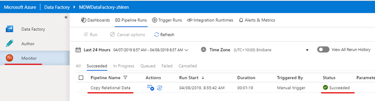

## Visualize Data with Power BI
In this section you are going to use Power BI to visualize data from Azure SQL Data Warehouse. The Power BI report will use an Import connection to query Azure SQL Data Warehouse and visualise Motor Vehicle Collision data from the table you loaded in the previous exercise.

**IMPORTANT**|
-------------|
**Execute these steps inside the MDWDesktop remote desktop connection**|

1.	On MDWDesktop, download the Power BI report from the link https://aka.ms/MDWLab1 and save it on the Desktop.
2.	Open the file MDWLab1.pbit with Power BI Desktop. Optionally sign up for the Power BI tips and tricks email, or to dismiss this, click to sign in with an existing account, and then hit the escape key.
3.	When prompted to enter the value of the **MDWSQLVirtualServer** parameter, type the full server name: mdwsqlvirtualserver-*suffix*.database.windows.net
4.	Click Load, and then Run to acknowledge the Native Database Query message
5.	When prompted, enter the **Database** credentials:
    <br>- **User Name**: MDWAdmin
    <br>- **Password**: P@ssw0rd123!

    

6.	Once the data is finished loading, interact with the report by changing the CollisionDate slicer and by clicking on the other visualisations.
7.	Save your work and close Power BI Desktop.

    