# Lab 1: Load Data into Azure Synapse Analytics using Azure Data Factory Pipelines

In this lab, the dataset you will use contains data about motor vehicle collisions that happened in New Your City from 2012 to 2019 stored in a relational database. You will configure the Azure environment to allow relational data to be transferred from an Azure SQL Database to an Azure Synapse Analytics data warehouse using Azure Data Factory also staging to Azure Data Lake storage. You will use Power BI to visualise collision data loaded from your Azure Synapse data warehouse.

The estimated time to complete this lab is: **45 minutes**.

## Microsoft Learn & Technical Documentation

The following Azure services will be used in this lab. If you need further training resources or access to technical documentation please find in the table below links to Microsoft Learn and to each service's Technical Documentation.

Azure Service | Microsoft Learn | Technical Documentation|
--------------|-----------------|------------------------|
Azure SQL Database | [Work with relational data in Azure](https://docs.microsoft.com/en-us/learn/paths/work-with-relational-data-in-azure/) | [Azure SQL Database Technical Documentation](https://docs.microsoft.com/en-us/azure/sql-database/)
Azure Data Factory | [Data ingestion with Azure Data Factory](https://docs.microsoft.com/en-us/learn/modules/data-ingestion-with-azure-data-factory/)| [Azure Data Factory Technical Documentation](https://docs.microsoft.com/en-us/azure/data-factory/)
Azure Synapse Analytics | [Implement a Data Warehouse with Azure Synapse Analytics](https://docs.microsoft.com/en-us/learn/paths/implement-sql-data-warehouse/) | [Azure Synapse Analytics Technical Documentation](https://docs.microsoft.com/en-us/azure/sql-data-warehouse/)
Azure Data Lake Storage Gen2 | [Large Scale Data Processing with Azure Data Lake Storage Gen2](https://docs.microsoft.com/en-us/learn/paths/data-processing-with-azure-adls/) | [Azure Data Lake Storage Gen2 Technical Documentation](https://docs.microsoft.com/en-us/azure/storage/blobs/data-lake-storage-introduction)

## Lab Architecture
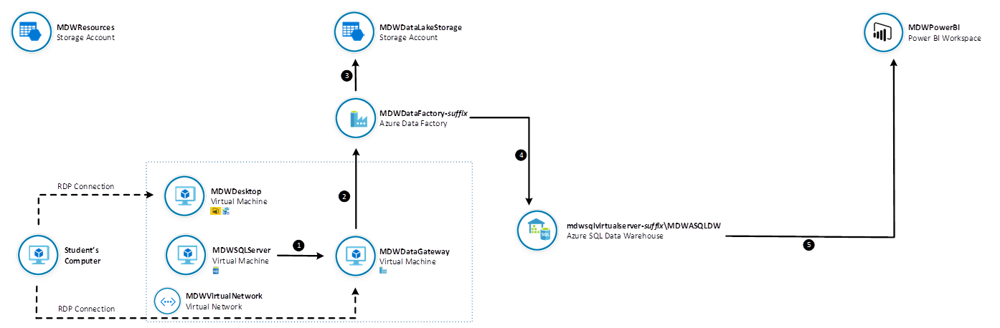

Step     | Description
-------- | -----
 | Build an Azure Data Factory Pipeline to copy data from an Azure SQL Database table
 | Use Azure Data Lake Storage Gen2 as a staging area for Polybase
 | Load data to an Azure Synapse Analytics table using Polybase
 | Visualize data from Azure Synapse Analytics using Power BI

**IMPORTANT**: Some of the Azure services provisioned require globally unique name and a “-suffix” has been added to their names to ensure this uniqueness. Please take note of the suffix generated as you will need it for the following resources in this lab:

Name	                     |Type
-----------------------------|--------------------
SynapseDataFactory-*suffix*	     |Data Factory (V2)
synapsedatalake*suffix*	         |Data Lake Storage Gen2
synapsesql-*suffix* |SQL server
operationalsql-*suffix* |SQL server

## Connect to ADPDesktop
In this section you are going to establish a Remote Desktop Connection to ADPDesktop virtual machine.

**IMPORTANT**: If you are executing the lab in a Spektra CloudLabs environment, you will be automatically connected to the ADPDesktop VM and there is no need to execute the steps below. You can skip to the next section **Install required software onto ADPDesktop**.

**IMPORTANT**|
-------------|
**Execute these steps on your host computer**|

1.	In the Azure Portal, navigate to the lab resource group and click the **ADPDesktop** virtual machine.

2.	On the ADPDesktop blade, from the Overview menu, click the Connect button.

    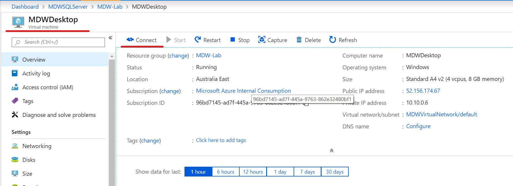

3.	On the **Connect to virtual machine** blade, click **Download RDP File**. This will download a .rdp file that you can use to establish a Remote Desktop Connection with the virtual machine.

    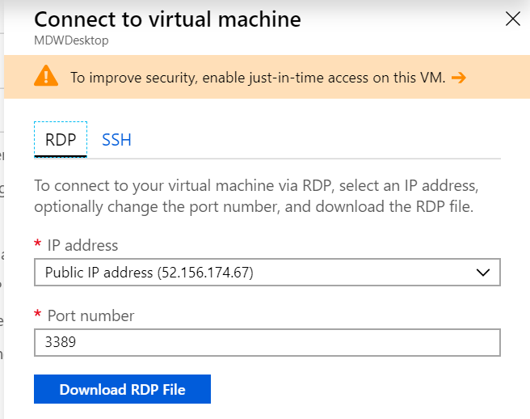

4.	Once the RDP file is downloaded, click on it to establish an RDP connection with ADPDesktop

5.	User the following credentials to authenticate:
    <br>- **User Name**: ADPAdmin
    <br>- **Password**: P@ssw0rd123!

6. If you connected successfully using RDP, skip this step and go to the next section. If you faced any connectivity issues connecting via Remote Desktop Protocol (RDP), you can try connect via Azure Bastion by clicking the **Bastion** tab and providing the credentials indicated in the next section. This will open a new browser tab with the remote connection via SSL and HTML5.

    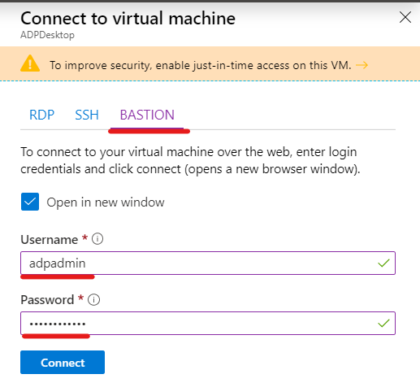

## Install required software onto ADPDesktop
In this section you are going to install Azure Data Studio and Power BI Desktop on ADPDesktop.

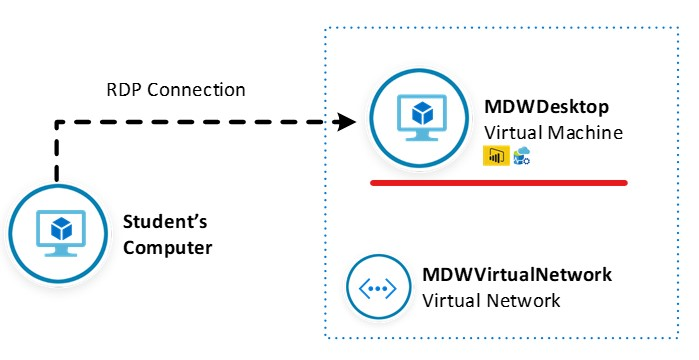

**IMPORTANT**|
-------------|
**Execute these steps inside the ADPDesktop remote desktop connection**|

3.	Once logged in, accept the default privacy settings.

4.	Using the browser, download and install the latest version of following software. During the setup, accept all default settings:
    <br>
    <br> **Azure Data Studio (User Installer)**
    <br>https://docs.microsoft.com/en-us/sql/azure-data-studio/download
    <br>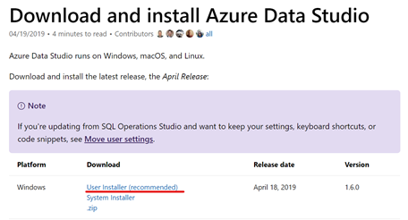
    <br>
    <br>**Power BI Desktop (64-bit)**
    <br>https://aka.ms/pbiSingleInstaller
    <br>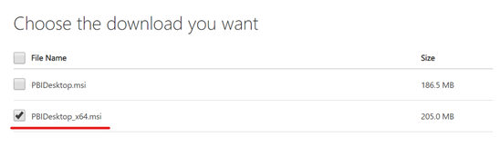

## Create Azure Synapse Analytics data warehouse objects
In this section you will connect to Azure Synapse Analytics to create the database objects used to host and process data.

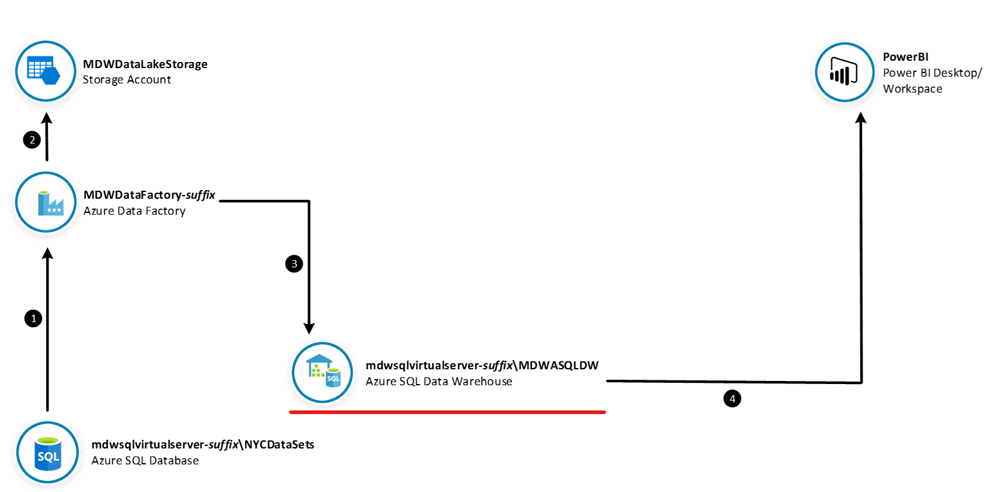

**IMPORTANT**|
-------------|
**Execute these steps inside the ADPDesktop remote desktop connection**|

1.	Open Azure Data Studio. On the Servers panel, click **New Connection**.

    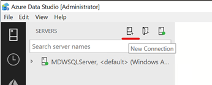

2.	On the **Connection Details** panel, enter the following connection details:
    <br> - **Server**: synapsesql-*suffix*.database.windows.net
    <br>- **Authentication Type**: SQL Login
    <br>- **User Name**: ADPAdmin
    <br>- **Password**: P@ssw0rd123!
    <br>- **Database**: SynapseDW

3.	Click **Connect**.

    

4.	Right-click the server name and click **New Query**.

    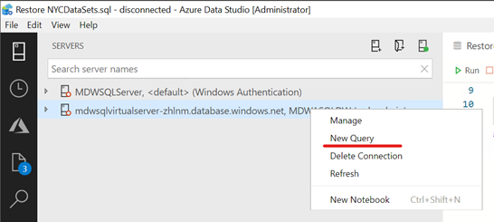

5.	On the new query window, create a new database schema named [NYC]. Use this SQL Command:

```sql
create schema [NYC]
go
```

6.	Create a new round robin distributed table named NYC.NYPD_MotorVehicleCollisions, see column definitions on the SQL Command:

```sql
create table [NYC].[NYPD_MotorVehicleCollisions](
	[UniqueKey] [int] NULL,
	[CollisionDate] [date] NULL,
	[CollisionDayOfWeek] [varchar](9) NULL,
	[CollisionTime] [time](7) NULL,
	[CollisionTimeAMPM] [varchar](2) NOT NULL,
	[CollisionTimeBin] [varchar](11) NULL,
	[Borough] [varchar](200) NULL,
	[ZipCode] [varchar](20) NULL,
	[Latitude] [float] NULL,
	[Longitude] [float] NULL,
	[Location] [varchar](200) NULL,
	[OnStreetName] [varchar](200) NULL,
	[CrossStreetName] [varchar](200) NULL,
	[OffStreetName] [varchar](200) NULL,
	[NumberPersonsInjured] [int] NULL,
	[NumberPersonsKilled] [int] NULL,
	[IsFatalCollision] [int] NOT NULL,
	[NumberPedestriansInjured] [int] NULL,
	[NumberPedestriansKilled] [int] NULL,
	[NumberCyclistInjured] [int] NULL,
	[NumberCyclistKilled] [int] NULL,
	[NumberMotoristInjured] [int] NULL,
	[NumberMotoristKilled] [int] NULL,
	[ContributingFactorVehicle1] [varchar](200) NULL,
	[ContributingFactorVehicle2] [varchar](200) NULL,
	[ContributingFactorVehicle3] [varchar](200) NULL,
	[ContributingFactorVehicle4] [varchar](200) NULL,
	[ContributingFactorVehicle5] [varchar](200) NULL,
	[VehicleTypeCode1] [varchar](200) NULL,
	[VehicleTypeCode2] [varchar](200) NULL,
	[VehicleTypeCode3] [varchar](200) NULL,
	[VehicleTypeCode4] [varchar](200) NULL,
	[VehicleTypeCode5] [varchar](200) NULL
) 
with (distribution = round_robin)
go
```

## Create Azure Data Factory Pipeline to Copy Relational Data
In this section you will build an Azure Data Factory pipeline to copy a table from NYCDataSets database to Azure Synapse Analytics data warehouse.

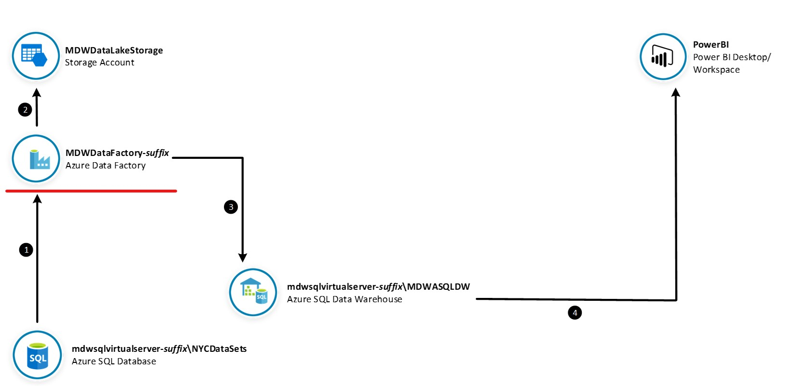

### Create Linked Service connections

**IMPORTANT**|
-------------|
**Execute these steps on your host computer**|

1.	In the Azure Portal, go to the lab resource group and locate the Azure Data Factory resource **SynapseDataFactory-*suffix***. 

2.	On the **Overview** panel, click **Author & Monitor**. The **Azure Data Factory** portal will open in a new browser tab.

    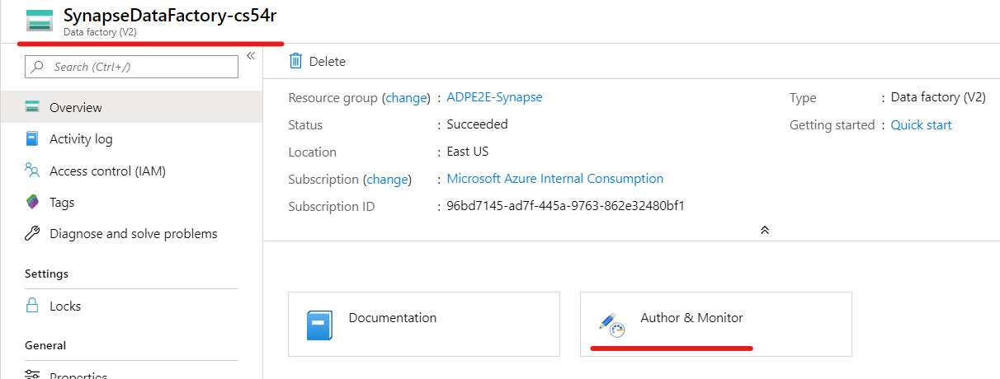


3. In the **Azure Data Factory** portal and click the **Manage *(toolcase icon)*** option on the left-hand side panel. Under **Linked services** menu item, click **+ New** to create a new linked service connection.

    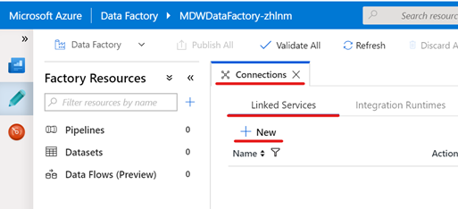

2.	On the **New Linked Service** blade, type “Azure SQL Database” in the search box to find the **Azure SQL Database** linked service. Click **Continue**.

    

3.	On the **New Linked Service (Azure SQL Database)** blade, enter the following details:
    <br>- **Name**: OperationalSQL_NYCDataSets
    <br>- **Account selection method**: From Azure subscription
    <br>- **Azure subscription**: *[your subscription]*
    <br>- **Server Name**: operationalsql-*suffix*
    <br>- **Database Name**: NYCDataSets
    <br>- **Authentication** Type: SQL Authentication 
    <br>- **User** Name: ADPAdmin
    <br>- **Password**: P@ssw0rd123!

4.	Click **Test connection** to make sure you entered the correct connection details and then click **Finish**.

    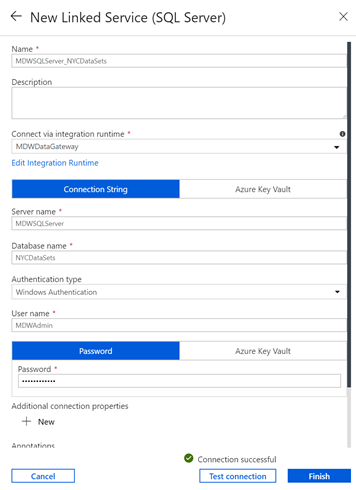

5.	Repeat the process to create an **Azure Synapse Analytics** linked service connection.

    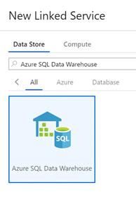

6.	On the New Linked Service (Azure Synapse Analytics) blade, enter the following details:
    <br>- **Name**: SynapseSQL_SynapseDW
    <br>- **Connect via integration runtime**: AutoResolveIntegrationRuntime
    <br>- **Account selection method**: From Azure subscription
    <br>- **Azure subscription**: *[your subscription]*
    <br>- **Server Name**: synapsesql-*suffix*
    <br>- **Database Name**: SynapseDW
    <br>- **Authentication** Type: SQL Authentication 
    <br>- **User** Name: ADPAdmin
    <br>- **Password**: P@ssw0rd123!
7.	Click **Test connection** to make sure you entered the correct connection details and then click **Finish**.

    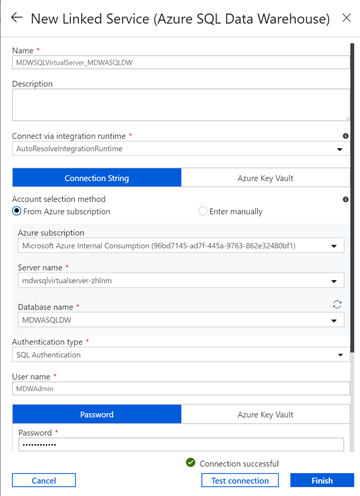

8.	Repeat the process once again to create an **Azure Blob Storage** linked service connection.

    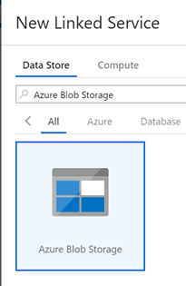

9.	On the **New Linked Service (Azure Blob Storage)** blade, enter the following details:
    <br>- **Name**: synapsedatalake
    <br>- **Connect via integration runtime**: AutoResolveIntegrationRuntime
    <br>- **Authentication method**: Account key
    <br>- **Account selection method**: From Azure subscription
    <br>- **Azure subscription**: *[your subscription]*
    <br>- **Storage account name**: synapsedatalake*suffix*
10.	Click **Test connection** to make sure you entered the correct connection details and then click **Finish**.

    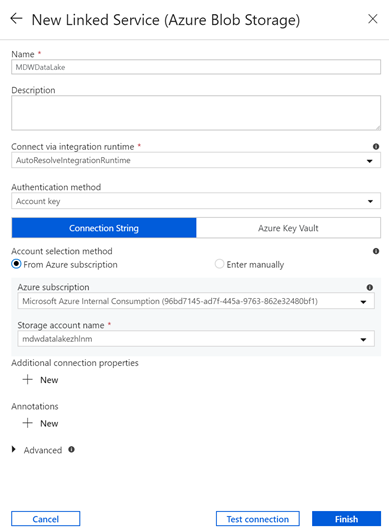

11.	You should now see 3 linked services connections that will be used as source, destination and staging.

    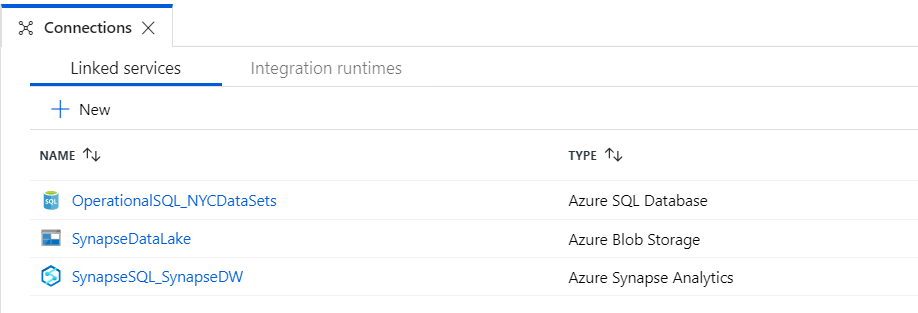

### Create Source and Destination Data Sets

**IMPORTANT**|
-------------|
**Execute these steps on your host computer**|

1.	Open the **Azure Data Factory** portal and click the **Author *(pencil icon)*** option on the left-hand side panel. Under **Factory Resources** tab, click the ellipsis **(…)** next to **Datasets** and then click **New Dataset** to create a new dataset.

    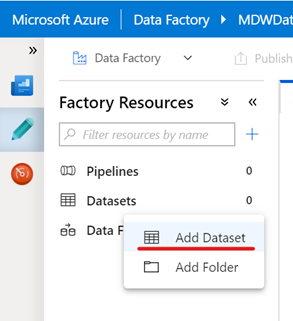

2.	Type "Azure SQL Database" in the search box and select **Azure SQL Database**. Click **Finish**.

    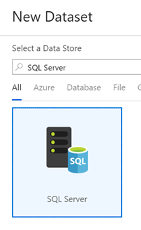

3.	On the **New Data Set** tab, enter the following details:
    <br>- **Name**: NYCDataSets_MotorVehicleCollisions
    <br>- **Linked Service**: OperationalSQL_NYCDataSets
    <br>- **Table**: [NYC].[NYPD_MotorVehicleCollisions]

    Alternatively you can copy and paste the dataset JSON definition below:

    ```json
    {
        "name": "NYCDataSets_MotorVehicleCollisions",
        "properties": {
            "linkedServiceName": {
                "referenceName": "OperationalSQL_NYCDataSets",
                "type": "LinkedServiceReference"
            },
            "folder": {
                "name": "Lab1"
            },
            "annotations": [],
            "type": "AzureSqlTable",
            "schema": [],
            "typeProperties": {
                "schema": "NYC",
                "table": "NYPD_MotorVehicleCollisions"
            }
        }
    }
    ```

4.	Leave remaining fields with default values and click **Continue**.

    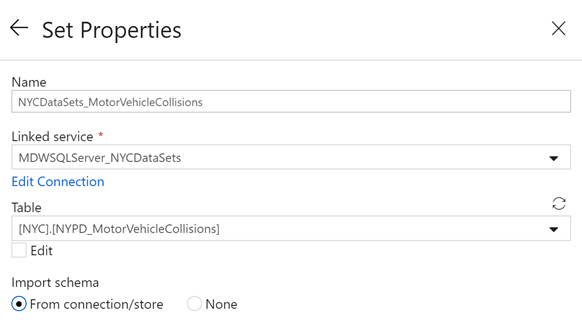

5.	Repeat the process to create a new **Azure Synapse Analytics** data set.

    

6.	On the **New Data Set** tab, enter the following details:
    <br>- **Name**: SynapseDW_MotorVehicleCollisions
    <br>- **Linked Service**: SynapseSQL_SynapseDW
    <br>- **Table**: [NYC].[NYPD_MotorVehicleCollisions]

    Alternatively you can copy and paste the dataset JSON definition below:

    ```json
    {
        "name": "SynapseDW_MotorVehicleCollisions",
        "properties": {
            "linkedServiceName": {
                "referenceName": "SynapseSQL_SynapseDW",
                "type": "LinkedServiceReference"
            },
            "folder": {
                "name": "Lab1"
            },
            "annotations": [],
            "type": "AzureSqlDWTable",
            "schema": [],
            "typeProperties": {
                "schema": "NYC",
                "table": "NYPD_MotorVehicleCollisions"
            }
        }
    }
    ```

7.	Leave remaining fields with default values and click **Continue**.

    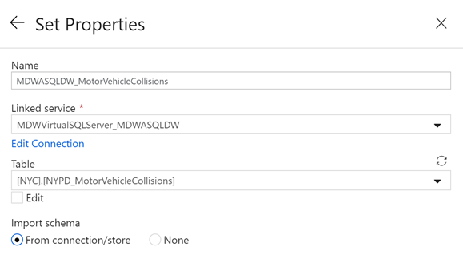

8. Under **Factory Resources** tab, click the ellipsis **(…)** next to **Datasets** and then click **New folder** to create a new Folder. Name it **Lab1**.

9. Drag the two datasets created into the **Lab1** folder you just created.

    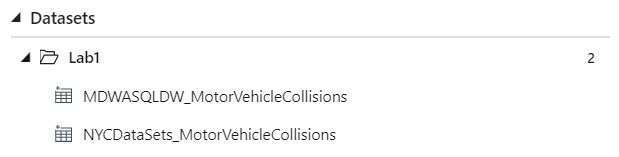

10.	Publish your dataset changes by clicking the **Publish All** button on the top of the screen.

    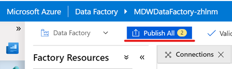

### Create and Execute Pipeline

**IMPORTANT**|
-------------|
**Execute these steps on your host computer**|

1.	Open the **Azure Data Factory** portal and click the **Author *(pencil icon)*** option on the left-hand side panel. Under **Factory Resources** tab, click the ellipsis **(…)** next to **Pipelines** and then click **New Pipeline** to create a new pipeline.
2.	On the **New Pipeline** tab, enter the following details:
    <br>- **General > Name**: Lab1 - Copy Collision Data
3.	Leave remaining fields with default values.

    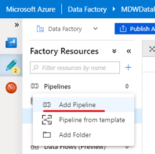

4.	From the **Activities** panel, type “Copy Data” in the search box. Drag the **Copy Data** activity on to the design surface.
5.	Select the **Copy Data** activity and enter the following details:
    <br>- **General > Name**: CopyMotorVehicleCollisions
    <br>- **Source > Source dataset**: NYCDataSets_MotorVehicleCollisions
    <br>- **Sink > Sink dataset**: SynapseDW_MotorVehicleCollisions
    <br>- **Sink > Allow PolyBase**: Checked
    <br>- **Settings > Enable staging**: Checked
    <br>- **Settings > Staging account linked service**: synapsedatalake
    <br>- **Settings > Storage Path**: polybase
6.	Leave remaining fields with default values.

    
    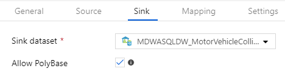
    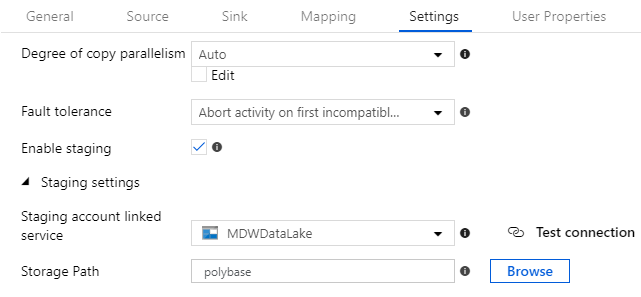

7.	Publish your pipeline changes by clicking the **Publish all** button.

    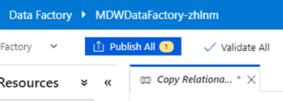

8.	To execute the pipeline, click on **Add trigger** menu and then **Trigger Now**.
9.	On the **Pipeline Run** blade, click **Finish**.

    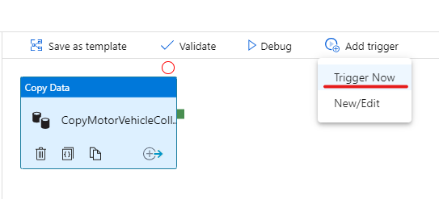

10.	To monitor the execution of your pipeline, click on the **Monitor** menu on the left-hand side panel.
11.	You should be able to see the Status of your pipeline execution on the right-hand side panel.

    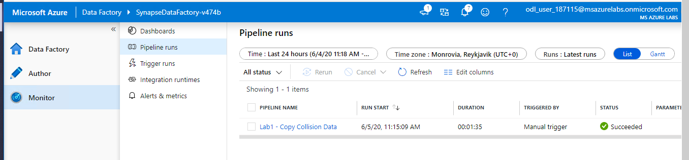

## Visualize Data with Power BI
In this section you are going to use Power BI to visualize data from Azure Synapse Analytics. The Power BI report will use an Import connection to query Azure Synapse Analytics and visualise Motor Vehicle Collision data from the table you loaded in the previous exercise.

**IMPORTANT**|
-------------|
**Execute these steps inside the ADPDesktop remote desktop connection**|

1.	On ADPDesktop, download the Power BI report from the link https://aka.ms/ADPLab1 and save it on the Desktop.
2.	Open the file ADPLab1.pbit with Power BI Desktop. Optionally sign up for the Power BI tips and tricks email, or to dismiss this, click to sign in with an existing account, and then hit the escape key.
3.	When prompted to enter the value of the **SynapseSQLEnpoint** parameter, type the full server name: synapsesql-*suffix*.database.windows.net

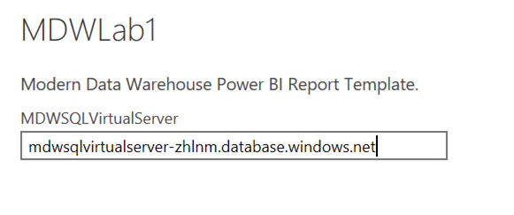

4.	Click Load, and then Run to acknowledge the Native Database Query message
5.	When prompted, enter the **Database** credentials:
    <br>- **User Name**: adpadmin
    <br>- **Password**: P@ssw0rd123!


6.	Once the data is finished loading, interact with the report by changing the CollisionDate slicer and by clicking on the other visualisations.
7.	Save your work and close Power BI Desktop.

    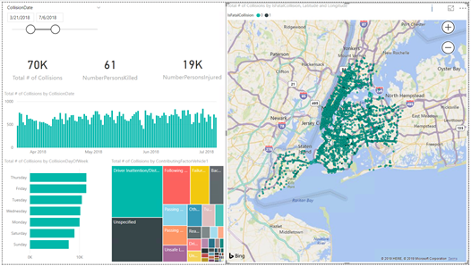
