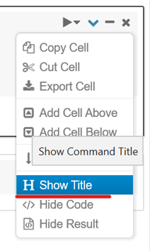
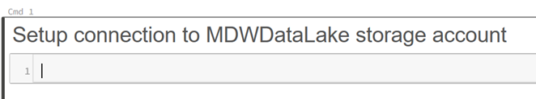
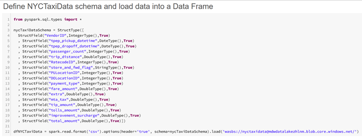

# Lab 3: Explore Big Data using Azure Databricks
In this lab you will use Azure Databricks to explore the New York Taxi data files you saved in your data lake in Lab 2. Using a Databricks notebook you will connect to the data lake and query taxi ride details. 

The estimated time to complete this lab is: **20 minutes**.

## Lab Architecture


Step     | Description
-------- | -----
 |Build an Azure Databricks notebook to explore the data files you saved in your data lake in the previous exercise. You will use Python and SQL commands to open a connection to your data lake and query data from data files.

**IMPORTANT**: Some of the Azure services provisioned require globally unique name and a “-suffix” has been added to their names to ensure this uniqueness. Please take note of the suffix generated as you will need it for the following resources:

Name	                     |Type
-----------------------------|--------------------
mdwdatalake*suffix*	         |Storage Account
MDWDatabricks-*suffix*	     |Databricks Workspace

## Create Azure Databricks Cluster 
In this section you are going to create an Azure Databricks cluster that will be used to execute notebooks.

**IMPORTANT**|
-------------|
**Execute these steps on your host computer**|

1.	In the Azure Portal, navigate to the MDW-Lab resource group and locate the Azure Databricks resource MDWDatabricks-*suffix*.
2.	On the **MDWDatabricks-*suffix*** blade, click the **Launch Workspace** button. The Azure Databricks portal will open on a new browser tab.

    

3.	On the Azure Databricks portal, click the **Clusters** button on the left-hand side menu. 
4.	On the **Clusters** blade, click **+ Create Cluster**.

    

5.	On the Create Cluster blade, type “MDWDatabricksCluster” in the **Cluster Name** field. Leave all other fields with their default values.
6.	Click **Create Cluster**. It should take around 5 minutes for the cluster to be fully operational.

    

## Create an Azure Databricks Notebook 
In this section you are going to create an Azure Databricks notebook that will be used to explore the taxi data files you copied to your data lake in the Lab 2. 

**IMPORTANT**|
-------------|
**Execute these steps on your host computer**|

1.	On the Azure Databricks portal, click the **Home** button on the left-hand side menu. 
2.	On the **Workspace** blade, click the down arrow next to your user name and then click **Create > Notebook**.

    

3.	On the **Create Notebook** pop-up window type “NYCTaxiData” in the Name field.
4.	Ensure you have the **Language** field set to **Python** and the **Cluster** field is set to **MDWDatabricksCluster**.
5.	Click **Create**.

    

6.	On the **Cmd 1** cell, click the **Edit** button on the top right-hand corner of the cell and then click **Show Title**.
7.	Type “Setup connection to MDWDataLake storage account” in the cell title.

    
    

8.	On the **Cmd 1** cell, you will invoke the Spark API to establish a connection to your MDWDataLake storage account. For this you will need to retrieve the name and key of your MDWDataLake storage account from the Azure Portal. 

    

9.	Use the Python code below and replace *[your MDWDataLake storage account name]* with **mdwdatalake*suffix*** and to replace *[your MDWDataLake storage account key]* with the storage account key.

```python
spark.conf.set(
  "fs.azure.account.key.[your MDWDataLake storage account name].blob.core.windows.net",
  "[your MDWDataLake storage account key]")

```

10.	Press **Shift + Enter** to execute and create a new notebook cell. 
Set the title of the **Cmd 2** cell to “Define NYCTaxiData schema and load data into a Data Frame”

11.	In the **Cmd 2** cell, define a new **StructType** object that will contain the definition of the data frame schema.
12.	Using the schema defined above, initialise a new data frame by invoking the Spark API to read the contents of the nyctaxidata container in the MDWDataLake storage account. Use the Python code below:

```python
from pyspark.sql.types import *

nycTaxiDataSchema = StructType([
  StructField("VendorID",IntegerType(),True)
  , StructField("tpep_pickup_datetime",DateType(),True)
  , StructField("tpep_dropoff_datetime",DateType(),True)
  , StructField("passenger_count",IntegerType(),True)
  , StructField("trip_distance",DoubleType(),True)
  , StructField("RatecodeID",IntegerType(),True)
  , StructField("store_and_fwd_flag",StringType(),True)
  , StructField("PULocationID",IntegerType(),True)
  , StructField("DOLocationID",IntegerType(),True)
  , StructField("payment_type",IntegerType(),True)
  , StructField("fare_amount",DoubleType(),True)
  , StructField("extra",DoubleType(),True)
  , StructField("mta_tax",DoubleType(),True)
  , StructField("tip_amount",DoubleType(),True)
  , StructField("tolls_amount",DoubleType(),True)
  , StructField("improvement_surcharge",DoubleType(),True)
  , StructField("total_amount",DoubleType(),True)])
  
dfNYCTaxiData = spark.read.format('csv').options(header='true', schema=nycTaxiDataSchema).load('wasbs://nyctaxidata@[your MDWDataLake storage account name].blob.core.windows.net/')
```

13.	Remember to replace *[your MDWDataLake storage account name]* with **mdwdatalake*suffix*** and to replace *[your MDWDataLake storage account key]* with the storage account key. Your **Cmd 2** cell should look like this:

    

14.	Hit **Shift + Enter** to execute the command and create a new cell. 
15.	Set the title of the **Cmd 3** cell to “Display Data Frame Content”.
16.	In the **Cmd 3** cell, call the display function to show the contents of the data frame dfNYCTaxiData. Use the Python code below:

```python
display(dfNYCTaxiData)
```
17.	Hit **Shift + Enter** to execute the command and create a new cell. You will see a data grid showing the top 1000 records from the dataframe:

    

18.	Set the title of the **Cmd 4** cell to “Create Temp View”
19.	In the **Cmd 4** cell, call the **createOrReplaceTempView** method of the data frame object to create a temporary view of the data in memory. Use the Python code below:

```python
dfNYCTaxiData.createOrReplaceTempView('NYCTaxiDataTable')
```
20.	Hit **Shift + Enter** to execute the command and create a new cell. 

21.	Set the title of the Cmd 5 cell to “Use SQL to count NYC Taxi Data records”

22.	In the **Cmd 5** cell, change the default language to SQL using the %sql command. 

23.	Write a SQL query to retrieve the total number of records in the NYCTaxiDataTable view. Use the command below:

```sql
%sql
select count(*) from NYCTaxiDataTable
```

24.	Hit **Shift + Enter** to execute the command and create a new cell. You will see the total number of records in the data frame at the bottom of the cell.

    

25.	Set the title of the **Cmd 6** cell to “Use SQL to filter NYC Taxi Data records”

26.	In the **Cmd 6** cell, write a SQL query to filter taxi rides that happened on the Apr, 7th 2018 that had more than 5 passengers. Use the command below:

```sql
%sql

select cast(tpep_pickup_datetime as date) as pickup_date
  , tpep_dropoff_datetime
  , passenger_count
  , total_amount
from NYCTaxiDataTable
where cast(tpep_pickup_datetime as date) = '2018-04-07'
  and passenger_count > 5
```

27.	Hit **Shift + Enter** to execute the command. You will see a grid showing the filtered result set.

    

28.	Set the title of the **Cmd 7** cell to “Use SQL to aggregate NYC Taxi Data records and visualize data”

29.	In the **Cmd 7** cell, write a SQL query to aggregate records and return total number of rides by payment type. Use the command below:

```sql
%sql

select case payment_type
            when 1 then 'Credit card'
            when 2 then 'Cash'
            when 3 then 'No charge'
            when 4 then 'Dispute'
            when 5 then 'Unknown'
            when 6 then 'Voided trip'
        end as PaymentType
  , count(*) as TotalRideCount
from NYCTaxiDataTable
group by payment_type
order by TotalRideCount desc

```

30.	Hit **Ctrl + Enter** to execute the command. Results will be displayed in a grid in the cell.

31.	Click the **Bar chart** button to see results as a bar chart.

    
    

