# Lab 4: Add AI to your Big Data Pipeline with Cognitive Services
In this lab you will use Azure Data Factory to download New York City images to your data lake. Then, as part of the same pipeline, you are going to use an Azure Databricks notebook to invoke Computer Vision Cognitive Service to generate metadata documents and save them in back in your data lake. The Azure Data Factory pipeline then finishes by saving all metadata information in a Cosmos DB collection. You will use Power BI to visualise NYC images and their AI-generated metadata.

**IMPORTANT**: The typical use case for Cosmos DB is to serve as the operational database layer for data-driven applications (e.g. real-time personalisation). This lab intends to illustrates how analytics data pipelines can be used to deliver insights to intelligent apps through Cosmos DB. For the sake of keeping this lab simple we will use Power BI to query Cosmos DB data instead of an App.

The estimated time to complete this lab is: **75 minutes**.

## Microsoft Learn & Technical Documentation

Azure Service | Microsoft Learn | Technical Documentation|
--------------|-----------------|------------------------|
Azure Cognitive Vision Services | [Process and classify images with the Azure Cognitive Vision Services](https://docs.microsoft.com/en-us/learn/paths/classify-images-with-vision-services/) | [Azure Computer Vision Technical Documentation](https://docs.microsoft.com/en-us/azure/cognitive-services/computer-vision/)
Azure Cosmos DB | [Work with NoSQL data in Azure Cosmos DB](https://docs.microsoft.com/en-us/learn/paths/work-with-nosql-data-in-azure-cosmos-db/) | [Azure Cosmos DB Technical Documentation](https://docs.microsoft.com/en-us/azure/cosmos-db/)

## Lab Architecture
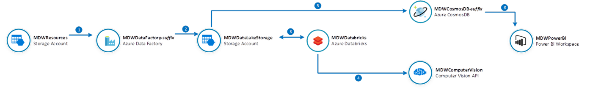

Step     | Description
-------- | -----
 | Build an Azure Data Factory Pipeline to copy image files from shared Azure Storage
 | Save image files to your data lake
 | For each image in your data lake, invoke an Azure Databricks notebook that will take the image URL as parameter
 | For each image call the Azure Computer Vision Cognitive service to generate image metadata. Metadata files are saved back in your data lake
 | Copy metadata JSON documents into your Cosmos DB database
 | Visualize images and associated metadata using Power BI

**IMPORTANT**: Some of the Azure services provisioned require globally unique name and a “-suffix” has been added to their names to ensure this uniqueness. Please take note of the suffix generated as you will need it for the following resources in this lab:

Name	                     |Type
-----------------------------|--------------------
mdwcosmosdb-*suffix*	     |Cosmos DB account
MDWDataFactory-*suffix*	     |Data Factory (V2)
mdwdatalake*suffix*	         |Storage Account
MDWDatabricks-*suffix*	     |Databricks Workspace

## Create NYCImages and NYCImageMetadata Containers in Azure Blob Storage
In this section you will create a container in your MDWDataLake that will be used as a repository for the NYC image files. You will copy 30 files from the MDWResources Storage Account into your NYCTaxiData container. 

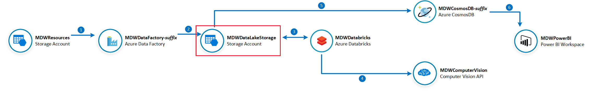

**IMPORTANT**|
-------------|
**Execute these steps on your host computer**|

1.	In the Azure Portal, go to the lab resource group and locate the Azure Storage account **mdwdatalake*suffix***. 
2.	On the **Overview** panel, click **Blobs**.

    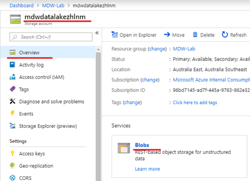

3.	On the **mdwdalalake*suffix* – Blobs** blade, click **+ Container**.

    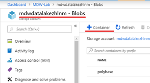

4.	On the New container blade, enter the following details:
    <br>- **Name**: nycimages
    <br>- **Public access level**: Blob (anonymous read access for blobs only)
5.	Click **OK** to create the new container.

    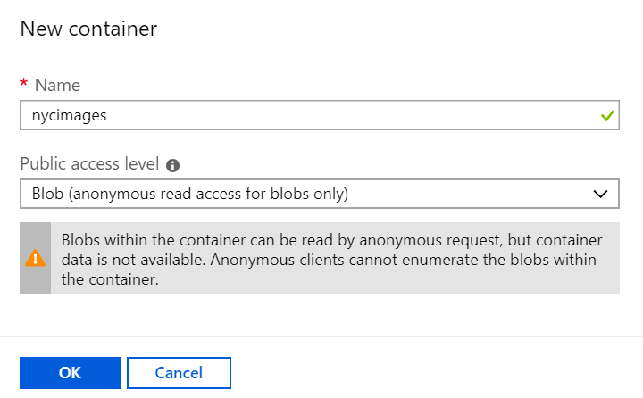

6.	Repeat the process to create the NYCImageMetadata container. This container will be used to host the metadata files generated by Cognitive Services before they can be saved in Cosmos DB.

    

7.	On the New container blade, enter the following details:
    <br>- **Name**: nycimagemetadata
    <br>- **Public access level**: Private (no anonymous access)
8.	Click **OK** to create the new container.

    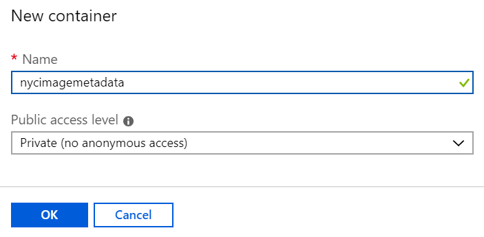

## Create CosmosDB database and collection
In this section you will create a CosmosDB database called NYC and a collection called ImageMetadata that will host New York image metadata information. 

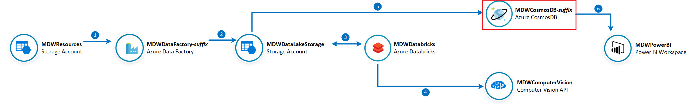

**IMPORTANT**|
-------------|
**Execute these steps on your host computer**|

1.	In the Azure Portal, go to the lab resource group and locate the CosmosDB account **MDWCosmosDB-*suffix***. 
2.	On the **Overview** panel, click **+ Add Container**.
    
    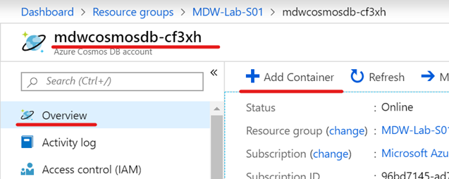

3.	On the **Add Container** blade, enter the following details:
    <br>- **Database id > Create new**: NYC
    <br>- **Container id**: ImageMetadata
    <br>- **Partition key**: /requestId
    <br>- **Throughput**: 400
    <br>- **Unique keys**: /requestId
4.	Click **OK** to create the container.

    

## Import Databricks Notebook to Invoke Computer Vision Cognitive Services API
In this section you will import a Databricks notebook to your workspace and fill out the missing details about your Computer Vision API and your Data Lake account. This notebook will be executed from an Azure Data Factory pipeline and it will invoke the Computer Vision API to generate metadata about the images and save the result back to your data lake.

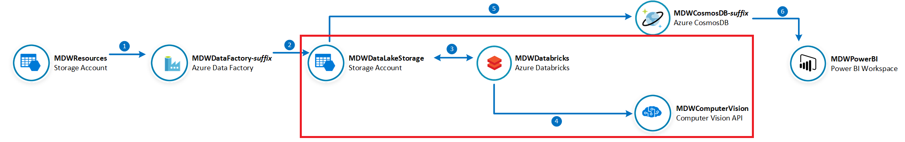

**IMPORTANT**|
-------------|
**Execute these steps on your host computer**|

1.	On the Azure Databricks portal, click the **Workspace** button on the left-hand side menu. 
2.	On the **Workspace** blade, click your username under the **Users** menu.
3.	On the **Users** blade, click the arrow next to your user name and then **Import**.

    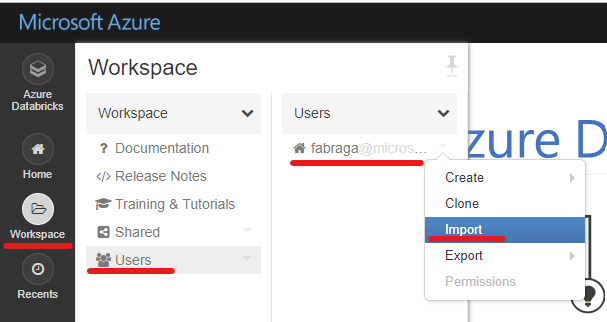

4.	On the **Import Notebooks** pop up window, select **Import from: URL**. Copy and paste the URL below in the box:

```url
https://github.com/fabragaMS/ADPE2E/raw/master/Lab/Lab4/NYCImageMetadata-Lab.dbc
```

5.	Click **Import**.

6.	On the NYCImageMetadata-Lab notebook, go to Cmd 2 cell **Define function to invoke Computer Vision API**. You will need to change the function code to include the Computer Vision API details.

    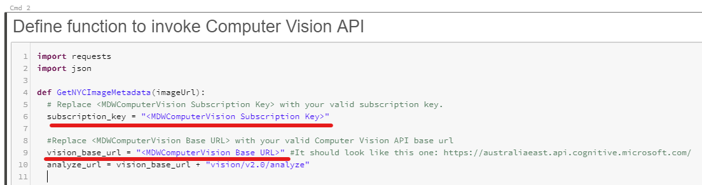

7.	From the Azure Portal, retrieve the MDWComputerVision subscription key and base endpoint URL.

    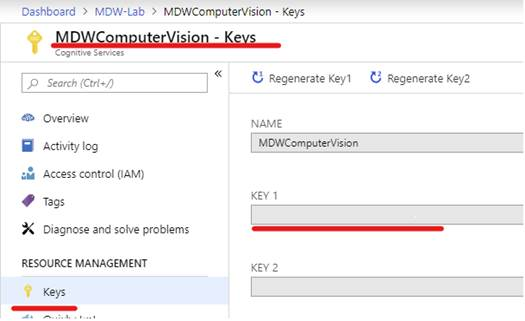
    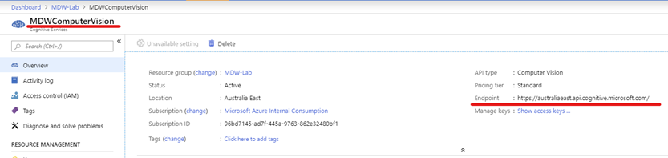

8.	Copy and paste the Key and Endpoint values back in the Databricks notebook.

    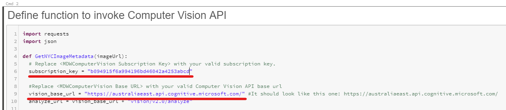

9.	On the NYCImageMetadata-Lab notebook, go to Cmd 3 cell **Define function to mount NYC Image Metadata Container**. You will need to change the function code to include your data lake storage account details.

10.	In the **dataLakeaccountName** variable assignment replace *&lt;MDWDataLake storage account name&gt;* with **mdwdatalake*suffix***.

    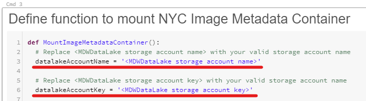

11.	From the Azure Portal, retrieve the **MDWDataLake*suffix*** access key.

    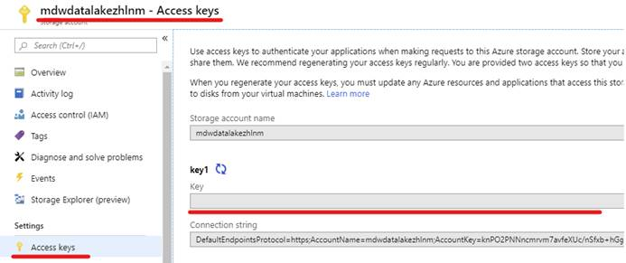

12.	Copy and paste the Access Key Databricks notebook. Replace *&lt;MDWDataLake storage account key&gt;* with the Access Key you got from the previous step.

    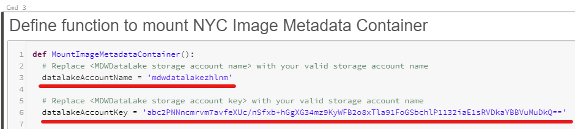

13.	Attach the notebook to your previously created **MDWDatabricksCluster** cluster.

    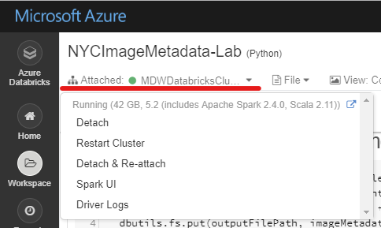

14.	Review the notebook code.

15.	If you want to test it, you can copy any publicly available image URL and paste it in the Image URL notebook parameter. You can use any of the following image URLs in the list as examples:

Test Image|Test Image URL|
----------|--------------|
|https://petlifetoday.com/wp-content/uploads/2018/06/wireless-dog-fence.jpg|
|https://static.pexels.com/photos/4204/nature-lawn-blur-flower.jpg|
|https://image.redbull.com/rbcom/052/2017-05-22/89eef344-d24f-4520-8680-8b8f7508b264/0012/0/0/0/2428/3642/800/1/best-beginner-motocross-bikes-ktm-250-sx-f.jpg|
|https://www.zastavki.com/pictures/originals/2014/World___Panama_City_landscape_in_panama_079246_.jpg|

16.	Click Run All to execute the notebook.

    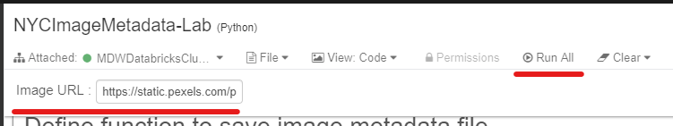

17.	After a successful execution you will notice that a new JSON file has been saved in the **NYCImageMetadata** container in your Data Lake. 

    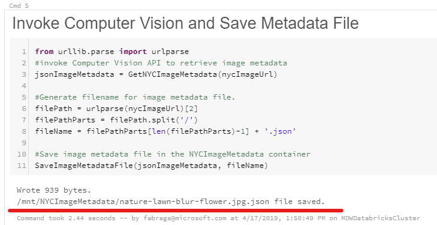

18.	Navigate to Azure Portal and check the contents of the **nycimagemetadata** container in your **MDWDataLake*suffix*** storage account.

19.	Download the file generated to inspect its contents.

20.	**IMPORTANT**: Delete this test file before moving to next steps of this exercise.

    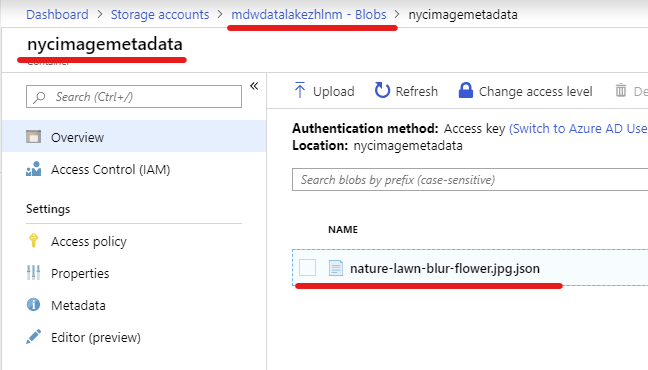

## Create Databricks Linked Service in Azure Data Factory
In this section you will create a Databricks linked service in Azure Data Factory. Through this linked service you will be able to create a data pipelines to copy NYC images to your data lake and integrate Databricks notebooks to its execution. 


**IMPORTANT**|
-------------|
**Execute these steps on your host computer**|

1.	On the Azure Databricks portal, click the **User** icon on the top right-hand corner of the screen.
2.	Click on the **User Settings** menu item.

    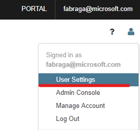

3.	On the **User Settings** blade, under the **Access Tokens** tab, click **Generate New Token**.

    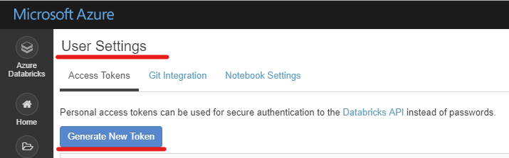

4.	On the **Generate New Token** pop-up window, enter “Azure Data Factory Access” in the **Comment** field. Leave **Lifetime (days)** with the default value of 90 days.
5.	Click **Generate**.

    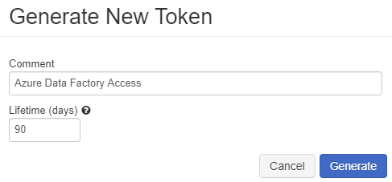

6.	**IMPORTANT**: Copy the generated access token to Notepad and save it. You won’t be able to retrieve it once you close this window.

    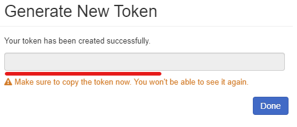

7.	Open the **Azure Data Factory portal** and click the **Author *(pencil icon)*** option on the left-hand side panel. Under **Connections** tab, click **Linked Services** and then click **+ New** to create a new linked service connection.

    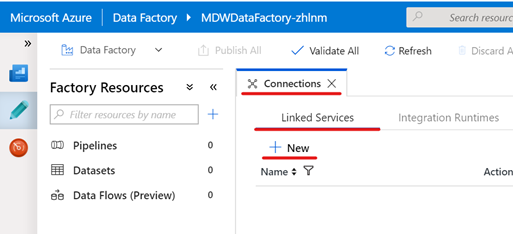

8.	On the **New Linked Service** blade, click the **Compute** tab. 

9.	Type “Azure Databricks” in the search box to find the **Azure Databricks** linked service. 

10.	Click **Continue**.

    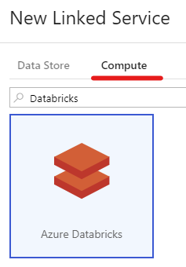

11.	On the **New Linked Service (Azure Databricks)** blade, enter the following details:
    <br>- **Name**: MDWDatabricks
    <br>- **Connect via integration runtime**: AutoResolveIntegrationRuntime
    <br>- **Account selection method**: From Azure subscription
    <br>- **Azure subscription**: [select your subscription]
    <br>- **Databricks workspace**: MDWDatabricks-*suffix*
    <br>- **Select cluster**: Existing interactive cluster
    <br>- **Access token**: <copy and paste access token here>
    <br>- **Choose from existing clusters**: MDWDatabricksCluster

    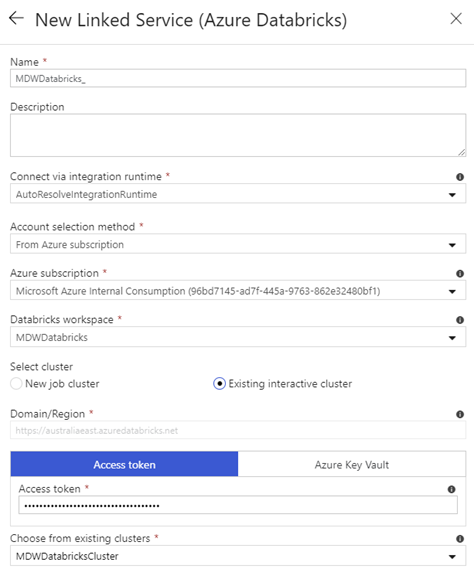

12.	Click **Test connection** to make sure you entered the correct connection details. You should see a “Connection successful” message above the button.

13.	If the connection was successful, then click **Finish**. If you got an error message, please review the connection details above and try again.

## Create CosmosDB Linked Service in Azure Data Factory

In this section you will create a CosmosDB linked service in Azure Data Factory. CosmosDB will be used as the final repository of image metadata information generated by the Computer Vision API. Power BI will then be used to visualise the CosmosDB data.


**IMPORTANT**|
-------------|
**Execute these steps on your host computer**|

1.	Open the Azure Data Factory portal and click the **Author *(pencil icon)*** option on the left-hand side panel. Under **Connections** tab, click **Linked Services** and then click **+ New** to create a new linked service connection.

    

2.	On the **New Linked Service** blade, click the **Data Store** tab. 

3.	Type “Cosmos DB” in the search box to find the **Azure Cosmos DB (SQL API)** linked service. 

4.	Click **Continue**.

    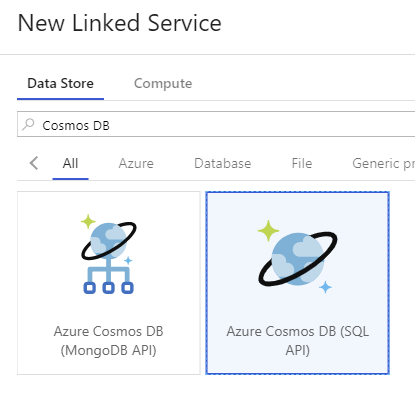

5.	On the New Linked Service (Azure Databricks) blade, enter the following details:
    <br>- **Name**: MDWCosmosDB
    <br>- **Connect via integration runtime**: AutoResolveIntegrationRuntime
    <br>- **Account selection method**: From Azure subscription
    <br>- **Azure subscription**: [select your subscription]
    <br>- **Cosmos DB account name**: mdwcosmosdb-*suffix*
    <br>- **Database name**: NYC

    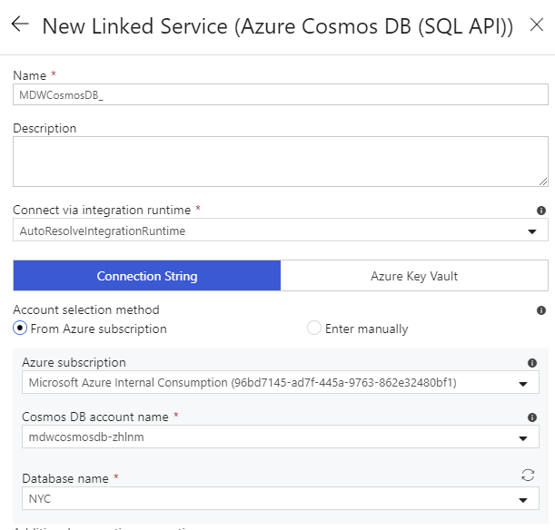

6.	Click **Test connection** to make sure you entered the correct connection details. You should see a “Connection successful” message above the button.

7.	If the connection was successful, then click **Finish**. If you got an error message, please review the connection details above and try again.

## Create Azure Data Factory data sets.
In this section you will create 4 Azure Data Factory data sets that will be used in the data pipeline.

Dataset | Description
--------|---------------
**MDWResources_NYCImages_Binary**| References MDWResources shared storage account container that contains source image files.
**MDWDataLake_NYCImages_Binary**| References your MDWDataLake-*suffix* storage account and it acts as the destination for the image files copied from MDWResources_NYCImages. 
**MDWDataLake_NYCImageMetadata_JSON**|References your MDWDataLake-*suffix* storage account and it acts as the source of image metadata files (JSON) generated by Databricks and Computer Vision. 
**MDWCosmosDB_ImageMetadata**| References MDWCosmosDB-*suffix* database that will save the metadata info for all images.


**IMPORTANT**|
-------------|
**Execute these steps on your host computer**|

1.	Open the Azure Data Factory portal and click the **Author *(pencil icon)*** option on the left-hand side panel. Under **Factory Resources** tab, click the ellipsis **(…)** next to **Datasets** and then click **Add Dataset** to create a new dataset.

    

2.	Type “Azure Blob Storage” in the search box and select **Azure Blob Storage**.

    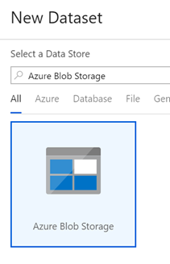

3.	On the **Select Format** blade, select **Binary** and click **Continue**.

    

4.	On the **Set Properties** blade, enter the following details:
    <br>- **Name**: MDWResources_NYCImages_Binary
    <br>- **Linked Service**: MDWResources
    <br>- **File Path**: **Container**: nycimages, **Directory**: [blank], **File**: [blank]

    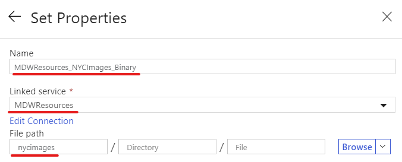

    Click **Continue**.

5.	Leave remaining fields with default values.

    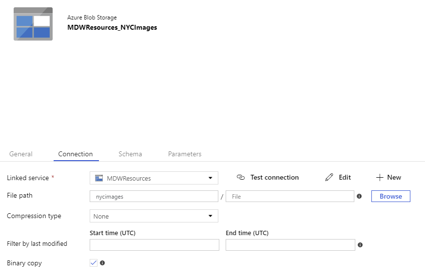

    Alternatively you can copy and paste the dataset JSON definition below:

    ```json
    {
        "name": "MDWResources_NYCImages_Binary",
        "properties": {
            "linkedServiceName": {
                "referenceName": "MDWResources",
                "type": "LinkedServiceReference"
            },
            "annotations": [],
            "type": "Binary",
            "typeProperties": {
                "location": {
                    "type": "AzureBlobStorageLocation",
                    "container": "nycimages"
                }
            }
        }
    }
    ```

6.	Repeat the process to create another dataset, this time referencing the **NYCImages** container in your **MDWDataLake-*suffix*** storage account. 

7.	Type “Azure Blob Storage” in the search box and click **Azure Blob Storage**.

    

8.	On the **Select Format** blade, select **Binary** and click **Continue**.

    

9.	On the **Set Properties** blade, enter the following details:
    <br>- **Name**: MDWDataLake_NYCImages_Binary
    <br>- **Linked Service**: MDWDataLake
    <br>- **File Path**: **Container**: nycimages, **Directory**: [blank], **File**: [blank]

    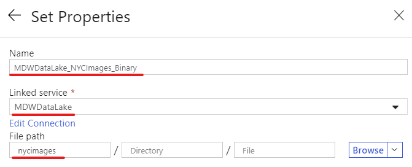

    Click **Continue**.

10.	Leave remaining fields with default values.

    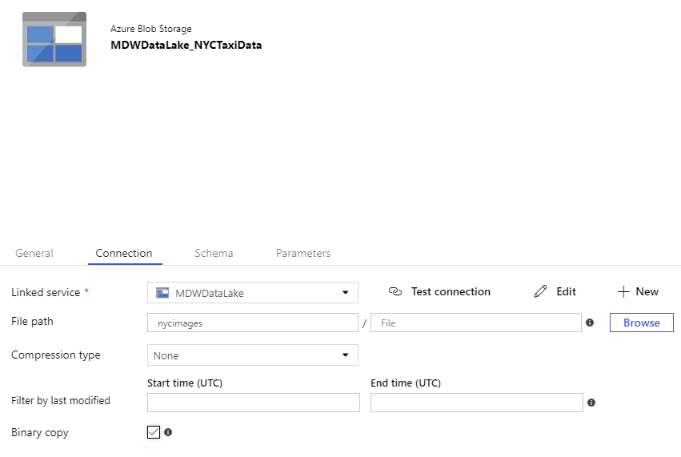
    Alternatively you can copy and paste the dataset JSON definition below:

    ```json
    {
        "name": "MDWDataLake_NYCImages_Binary",
        "properties": {
            "linkedServiceName": {
                "referenceName": "MDWDataLake",
                "type": "LinkedServiceReference"
            },
            "annotations": [],
            "type": "Binary",
            "typeProperties": {
                "location": {
                    "type": "AzureBlobStorageLocation",
                    "container": "nycimages"
                }
            }
        }
    }
    ```

11.	Repeat the process to create another dataset, this time referencing the **NYCImageMetadata** container in your **MDWDataLake-*suffix*** storage account. 

12.	Type “Azure Blob Storage” in the search box and click **Azure Blob Storage**

    

13.	On the **Select Format** blade, select **JSON** and click **Continue**.

    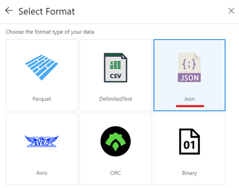

14.	On the **New Data Set** tab, enter the following details:
    <br>- **General > Name**: MDWDataLake_NYCImageMetadata_JSON
    <br>- **Connection > Linked Service**: MDWDataLake
    <br>- **Connection > File Path**: nycimagemetadata
    <br>- **File format**: JSON format

    Alternatively you can copy and paste the dataset JSON definition below:

    ```json
    {
        "name": "MDWDataLake_NYCImageMetadata_JSON",
        "properties": {
            "linkedServiceName": {
                "referenceName": "MDWDataLake",
                "type": "LinkedServiceReference"
            },
            "annotations": [],
            "type": "AzureBlob",
            "typeProperties": {
                "format": {
                    "type": "JsonFormat"
                },
                "fileName": "",
                "folderPath": "nycimagemetadata"
            }
        },
        "type": "Microsoft.DataFactory/factories/datasets"
    }
    ```
15.	Leave remaining fields with default values.

    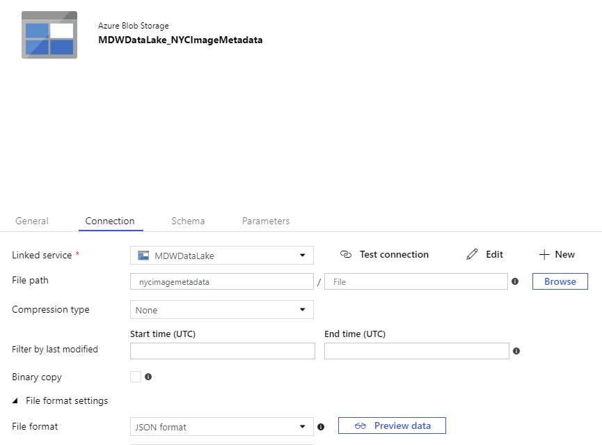

16.	Repeat the process to create another dataset, this time referencing the **ImageMetadata** collection in your **MDWCosmosDB** database. 

17.	Type “Cosmos DB” in the search box and select **Azure Cosmos DB (SQL API)**. Click **Continue**.

    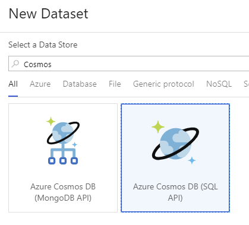

18.	On the New Data Set tab, enter the following details:
    <br>- **General > Name**: MDWCosmosDB_NYCImageMetadata
    <br>- **Connection > Linked Service**: MDWCosmosDB
    <br>- **Collection name**: ImageMetadata

    Alternatively you can copy and paste the dataset JSON definition below:

    ```json
    {
        "name": "MDWCosmosDB_NYCImageMetadata",
        "properties": {
            "linkedServiceName": {
                "referenceName": "MDWCosmosDB",
                "type": "LinkedServiceReference"
            },
            "type": "DocumentDbCollection",
            "typeProperties": {
                "collectionName": "ImageMetadata"
            }
        },
        "type": "Microsoft.DataFactory/factories/datasets"
    }
    ```
19.	Leave remaining fields with default values.

    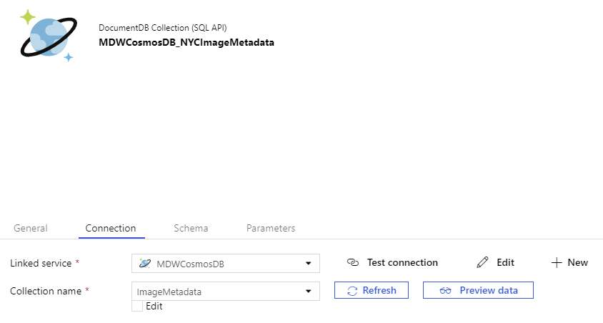

20.	Publish your dataset changes by clicking the **Publish all** button.

    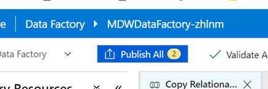

## Create Azure Data Factory pipeline to generate and save image metadata to Cosmos DB.

In this section you will create an Azure Data Factory pipeline to copy New York images from MDWResources into your MDWDataLakesuffix storage account. The pipeline will then execute a Databricks notebook for each image and generate a metadata file in the NYCImageMetadata container. The pipeline finishes by saving the image metadata content in a CosmosDB database.

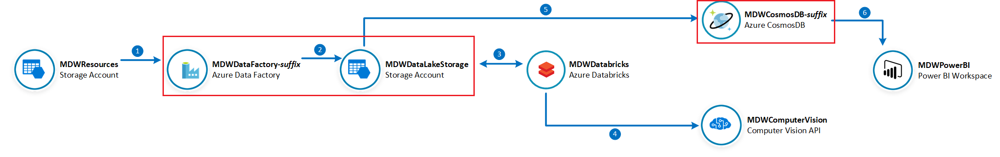

**IMPORTANT**|
-------------|
**Execute these steps on your host computer**|

1.	Open the Azure Data Factory portal and click the **Author *(pencil icon)*** option on the left-hand side panel. Under **Factory Resources** tab, click the ellipsis **(…)** next to **Pipelines** and then click **Add Pipeline** to create a new pipeline.

    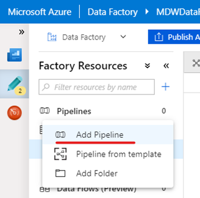

2.	On the **New Pipeline** tab, enter the following details:
    <br>- **General > Name**: Copy NYC Images
    <br>- **Variables > [click + New] >**
    <br>    - **Name**: ImageMetadataContainerUrl
    <br>    - **Default Value**: https://[your data lake account name].blob.core.windows.net/nycimages/

3.	Leave remaining fields with default values.

    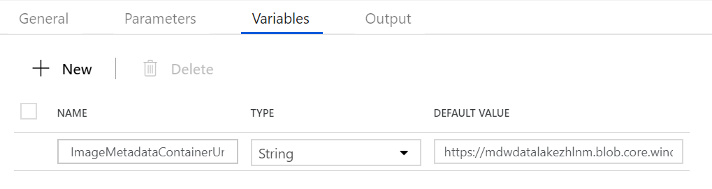

4.	From the **Activities** panel, type “Copy Data” in the search box. Drag the **Copy Data** activity on to the design surface. This copy activity will copy image files from shared storage account **MDWResources** to your **MDWDatalake** storage account.

5.	Select the **Copy Data** activity and enter the following details:
    <br>- **General > Name**: CopyImageFiles
    <br>- **Source > Source dataset**: MDWResources_NYCImages_Binary
    <br>- **Sink > Sink dataset**: MDWDataLake_NYCImages_Binary
    <br>- **Sink > Copy Behavior**: Preserve Hierarchy

6.	Leave remaining fields with default values.

    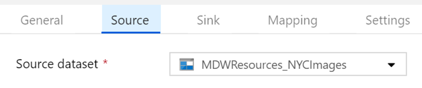
    

7.	From the **Activities** panel, type “Get Metadata” in the search box. Drag the **Get Metadata** activity on to the design surface. This activity will retrieve a list of image files saved in the NYCImages container by the previous CopyImageFiles activity. 

8.	Select the **Get Metadata** activity and enter the following details:
    <br>- **General > Name**: GetImageFileList
    <br>- **Dataset**: MDWDataLake_NYCImages_Binary
    <br>- **Source > Field list**: Child Items

9.	Leave remaining fields with default values.

    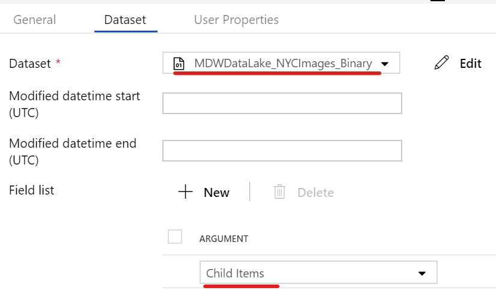

10.	Create a **Success *(green)*** precedence constraint between **CopyImageFiles** and **GetImageFileList** activities. You can do it by dragging the green connector from CopyImageFiles and landing the arrow onto GetImageFileList.

    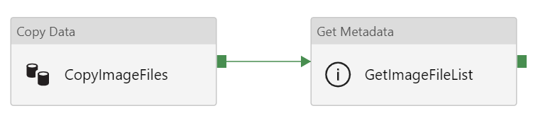

11.	From the **Activities** panel, type “ForEach” in the search box. Drag the **ForEach** activity on to the design surface. This ForEach activity will act as a container for other activities that will be executed in the context of each image files returned by the GetImageFileList activity. 

12.	Select the ForEach activity and enter the following details:
    <br>- **General > Name**: ForEachImage
    <br>- **Settings > Items**: 
    ```
    @activity('GetImageFileList').output.childItems
    ```

13.	Leave remaining fields with default values.

    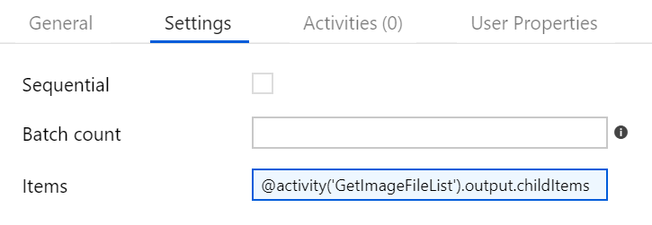

14.	Create a **Success *(green)*** precedence constraint between **GetImageFileList** and **ForEachImage** activities. You can do it by dragging the green connector from GetImageFileList and landing the arrow onto ForEachImage.

    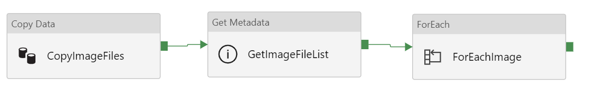

15.	Double-click the **ForEachImage** activity to edit its contents. 

    **IMPORTANT**: Note the design context is displayed on the top left-hand side of the design canvas.

    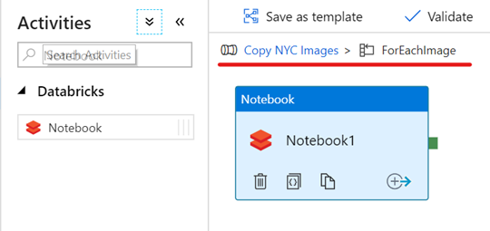

16.	From the **Activities** panel, type “Notebook” in the search box. Drag the **Notebook** activity on to the design surface. This Notebook activity will pass the image URL as a parameter to the Databricks notebook we created previously.

17.	Select the **Notebook** activity and enter the following details:
    <br>- **General > Name**: GetImageMetadata
    <br>- **Azure Databricks > Databricks Linked Service**: MDWDatabricks
    <br>- **Settings > Notebook path**: [Click Browse and navigate to /Users/*your-user-name*/ImageMetadata-Lab]
    <br>- **Base Parameters**: [Click **+ New**] >
    <br>- **nycImageUrl**: 
    ```
    @concat(variables('ImageMetadataContainerUrl'), item().name)
    ```
18.	Leave remaining fields with default values.

    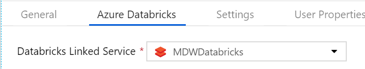
    

19.	Navigate back to the “Copy NYC Images” pipeline canvas.

20.	From the Activities panel, type “Copy Data” in the search box. Drag the **Copy Data** activity on to the design surface. This copy activity will copy image metadata from the JSON files sitting on the NYCImageMetadata container in MDWDataLake to the ImageMetadata collection on CosmosDB.

21.	Select the Copy Data activity and enter the following details:
    <br>- **General > Name**: ServeImageMetadata
    <br>- **Source > Source dataset**: MDWDataLake_NYCImageMetadata_JSON
    <br>- **Sink > Sink dataset**: MDWCosmosDB_NYCImageMetadata

22.	Leave remaining fields with default values.

    
    

23.	Create a **Success *(green)*** precedence constraint between **ForEachImage** and **ServeImageMetadata** activities. You can do it by dragging the green connector from ForEachImage and landing the arrow onto ServeImageMetadata.

    

24.	Publish your pipeline changes by clicking the **Publish all** button.

    

25.	To execute the pipeline, click on **Add trigger** menu and then **Trigger Now**.

26.	On the **Pipeline Run** blade, click **Finish**.

    

27.	To monitor the execution of your pipeline, click on the **Monitor** menu on the left-hand side panel.

28.	You should be able to see the **Status** of your pipeline execution on the right-hand side panel.

    

29.	Click the **View Activity Runs** button for detailed information about each activity execution in the pipeline. The whole execution should last between 7-8 minutes.

    

## Explore Image Metadata Documents in CosmosDB
In this section you will explore the image metadata records generated by the Azure Data Factory pipeline in CosmosDB. You will use the Cosmos DB’s SQL API to write SQL-like queries and retrieve data based on their criteria.

**IMPORTANT**|
-------------|
**Execute these steps on your host computer**|

1.	In the Azure Portal, go to the lab resource group and locate the CosmosDB account **MDWCosmosDB-*suffix***. 

2.	On the **Data Explorer** panel, click **Open Full Screen** button on the top right-hand side of the screen.

3.	On the **Open Full Screen** pop-up window, click **Open**.

    

4.	On the **Azure Cosmos DB Data Explorer window**, under **NYC > ImageMetadata** click **Items** to see the full list of documents in the collection.

5.	Click any document in the list to see its contents.

    

6.	Click the ellipsis **(…)** next to **ImageMetadata** collection.

7.	On the pop-up menu, click **New SQL Query** to open a new query tab.

    

8.	On the **New Query 1** window, try the two different SQL Commands from the list. Click the **Execute Selection** button to execute your query.

```sql
SELECT m.id
    , m.imageUrl 
FROM ImageMetadata as m
```

```sql
SELECT m.id
    , m.imageUrl 
    , tags.name
FROM ImageMetadata as m
    JOIN tags IN m.tags
WHERE tags.name = 'wedding'
```

10.	Check the results in the Results panel.

    

## Visualize Data with Power BI
In this section you are going to use Power BI to visualize data from Cosmos DB. The Power BI report will use an Import connection to retrieve image metadata from Cosmos DB and visualise images sitting in your data lake.

**IMPORTANT**|
-------------|
**Execute these steps on your host computer**|

1.	Navigate to the Azure Portal and retrieve the **mdwcosmosdb-*suffix*** access key.

2.	Save it to notepad. You will need it in the next step.

    

**IMPORTANT**|
-------------|
Execute these steps inside the **MDWDesktop** remote desktop connection|

1.	On MDWDesktop, download the Power BI report from the link https://aka.ms/MDWLab4 and save it in the Desktop.

2.	Open the file **MDWLab4.pbit** with Power BI Desktop.

3.	When prompted to enter the value of the **MDWCosmosDB** parameter, type the full server URI: https://mdwcosmosdb-*suffix*.documents.azure.com:443/

4.	Click **Load**.

    

5.	When prompted for an **Account Key**, paste the MDWCosmosDB account key you retrieved in the previous exercise.

6.	Click **Connect**.

    

7.	Once data finish loading, interact with the report by clicking on the different images displayed and check the accuracy of their associated metadata.

8.	Save your work and close Power BI Desktop.

    