# Lab 5: Ingest and Analyse real-time data with Event Hubs and Stream Analytics
In this lab you will use an Azure Logic App to connect to Twitter and generate a stream of messages using the hashtag #NYC. The logic app will invoke the Azure Text Analytics Cognitive service to score Tweet sentiment and send the messages to Event Hubs. You will use Stream Analytics to generate the average Tweet sentiment in the last 60 seconds and send the results to a real-time dataset in Power BI.

**IMPORTANT**: This lab requires you have a valid Twitter account. If you don’t have one, you can sign up for free following the instructions here: https://twitter.com/signup. 

**IMPORTANT**: This lab requires you have a valid Power BI account. If you don’t have one you can register for a 60-day trial here: https://powerbi.microsoft.com/en-us/power-bi-pro/

The estimated time to complete this lab is: **60 minutes**.

## Lab Architecture


Step     | Description
-------- | -----
 | Build an Azure Logic App to invoke the Twitter API and retrieve Tweets with the hashtag #NYC
 | For each Tweet, invoke the Azure Text Analytics Cognitive service to detect its sentiment score
 | Format and send the Tweet’s JSON message to Event Hubs
 | Save Tweet messages into your data lake for future analysis (cold path)
 | Send stream of Tweet messages to Stream Analytics for real-time analytics (hot path)
 | Visualize real-time data generated by Stream Analytics with Power BI

**IMPORTANT**: Some of the Azure services provisioned require globally unique name and a “-suffix” has been added to their names to ensure this uniqueness. Please take note of the suffix generated as you will need it for the following resources:

Name	                     |Type
-----------------------------|--------------------
mdwcosmosdb-*suffix*	     |Cosmos DB account
MDWDataFactory-*suffix*	     |Data Factory (V2)
mdwdatalake*suffix*	         |Storage Account
MDWEventHubs-*suffix*	     |Event Hubs Namespace
MDWKeyVault-*suffix*	     |Key vault
mdwsqlvirtualserver-*suffix* |SQL server
MDWStreamAnalytics-*suffix*	 |Stream Analytics job

# Create NYCTweets Container in Azure Blob Storage
In this section you will create a container in your MDWDataLake that will be used as a repository for the NYC image files. You will copy 30 files from the MDWResources Storage Account into your NYCTaxiData container. 

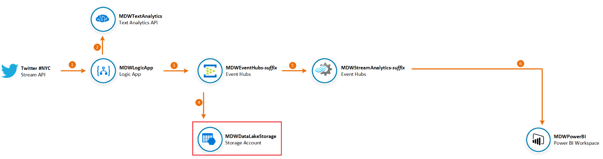

**IMPORTANT**|
-------------|
**Execute these steps on your host computer**|

1.	In the Azure Portal, go to the MDW-Lab resource group, and then locate and click the Azure Storage account **mdwdatalake*suffix***. 

2.	On the **Overview** panel, click **Blobs**.

    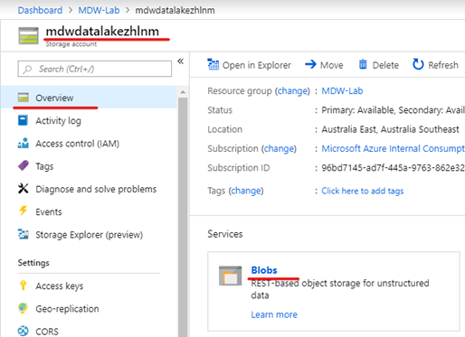

3.	On the **mdwdalalake*suffix* – Blobs** blade, click **+ Container**.

    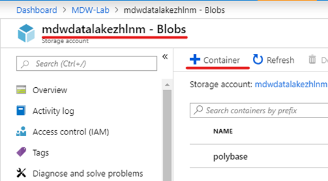

4.	On the New container blade, enter the following details:
    <br>- **Name**: nyctweets
    <br>- **Public access level**: Private (no anonymous access)

5.	Click **OK** to create the new container.

    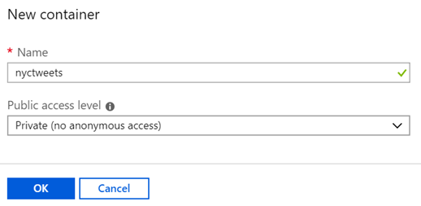

## Create and Configure Event Hubs
In this section you will prepare Event Hubs to ingest Twitter data collected by the Logic App and save incoming messages to your Data Lake storage account.


**IMPORTANT**|
-------------|
**Execute these steps on your host computer**|

1.	In the Azure Portal, go to the lab resource group and locate the Event Hubs resource **MDWEventHubs-*suffix***. 

2.	On the **Event Hubs** panel, click **+ Event Hub** button to create a new event hub.

    

3.	On the **Create Event Hub** blade, type “NYCTweets” in the Name field and leave the remaining fields with their default values.

4.	Click **Create**. 

    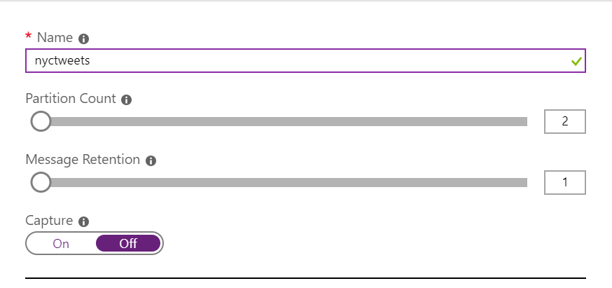

5.	Once the NYCTweets event hub is created, click Capture on the left-hand side menu.
6.	Enter the following details:
    <br>- **Capture**: On
    <br>- **Time window (minutes)**: 1
    <br>- **Do not emit empty files when no events occur during the capture time window**: Checked.
    <br>- **Capture Provider**: Azure Storage
    <br>- **Azure Storage Container**: [select the **nyctweets** container in your **MDWDataLake*suffix*** storage account]
7.	Leave remaining fields with their default values.
8.	Click **Save Changes**.

    

## Create Azure Logic App to Read #NYC Tweets and post them to Event Hubs
In this section you will create a Logic App to invoke the Twitter API and retrieve tweets for the hashtag #NYC. Tweets will then be formatted into a JSON message and sent to Event Hubs for processing.


**IMPORTANT**|
-------------|
**Execute these steps on your host computer**|

1.	In the Azure Portal, go to the lab resource group and locate the Logic App resource **MDWLogicApp**. 

2.	On the **MDWLogicApp** menu, click **Logic app designer** to open the design blade.

    

3.	On the **Logic app designer** blade, scroll down to the section **Start with a common trigger**.
4.	Click **When a new tweet is posted**.

    

5.	On the design surface you will see the Twitter connector. Click **Sign in** and use your personal Twitter account to authenticate.

    

6.	On the log on screen review the permissions that will be granted to logic apps. If you agree with the permissions granted then enter your credentials and click **Authorise app**.

7.	On the Confirmation Required page, click **Allow access** to proceed with the authentication process and to grant the right permissions to Logic Apps.

    

8.	Once authenticated with Twitter you will notice the green tick next to your user name. 

9.	Click **Continue** to configure the Twitter connector.

    

10.	On the **When a new tweet is posted** activity properties, enter the follow details:
    <br>- **Search text**: #NYC
    <br>- **Interval**: 10
    <br>- **Frequency**: Seconds

11.	Leave remaining fields with their default values.

12.	Click **+ New** step to create a new Logic App task.

    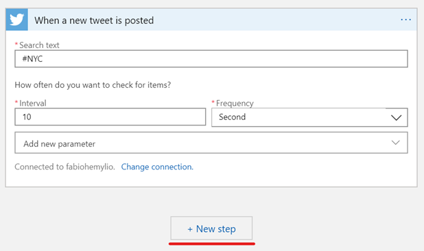

13.	On the **Choose an action** box, type “Text Analytics” in the search field. Select **Detect Sentiment (preview)** from the **Actions** tab.

    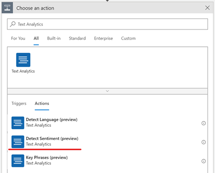

14.	On the **Text Analytics** properties, type “MDWTextAnalyticsConnection” in the **Connection Name** field.

15.	Open the **Azure Portal** in a new browser tab and copy **Endpoint** and **Key** values for MDWTextAnalytics. 

16.	Paste the values in the respective fields in the Text Analytics properties.

17.	Click **Create**.

    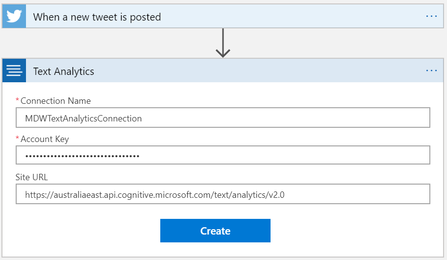

18.	In the **Detect Sentiment (preview)** properties, click **Add new parameter**.

19.	Select **Text** check box.

20.	In the **Text** parameter box, select **Tweet Text** from the **Dynamic content** list.

21.	Click **+ New step** to create a new task

    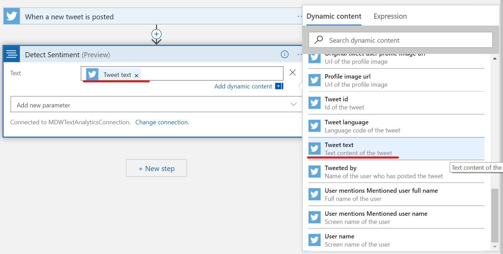

22.	Type “Compose” in the search box and select the **Compose** Data Operation.

    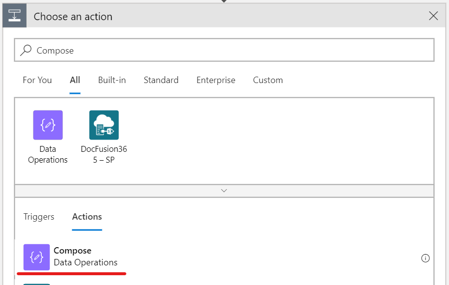

23.	On the **Compose** properties, build a new JSON message using data elements returned by the previous tasks. Your JSON message should look like this.

    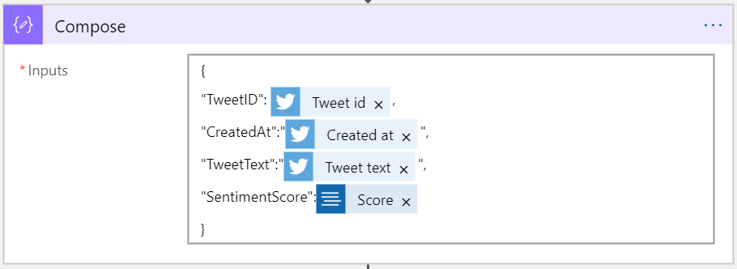

Alternatively you can copy and paste the JSON definition below:
```json
{
    "TweetID": @{triggerBody()?['TweetId']},
    "CreatedAt": "@{triggerBody()?['CreatedAtIso']}",
    "TweetText": "@{triggerBody()?['TweetText']}",
    "SentimentScore": @{body('Detect_Sentiment')?['score']}
}
```

24.	Click **+ New step** to create a new task.

25.	On the **Choose an action** box, type “Send event” in the search field. Select **Send Event** from the **Actions** tab.

    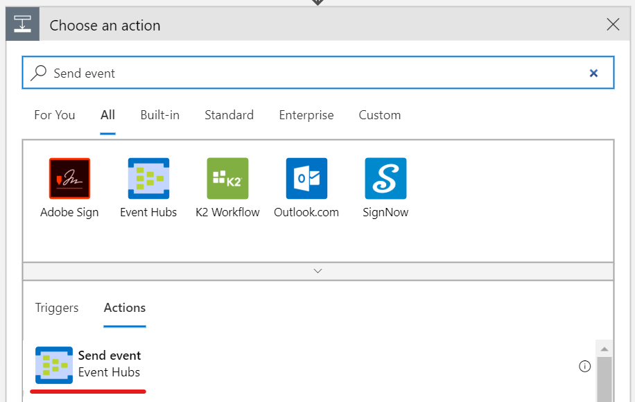

26.	On the **Send event** properties, type “MDWEventHubsConnection” in the **Connection Name** field.

27.	Select **MDWEventHubs-*suffix*** from the list of **Event Hubs Namespaces**.

28.	Select the default access policy **RootManageSharedAccessKey**.

29.	Click **Create**.

    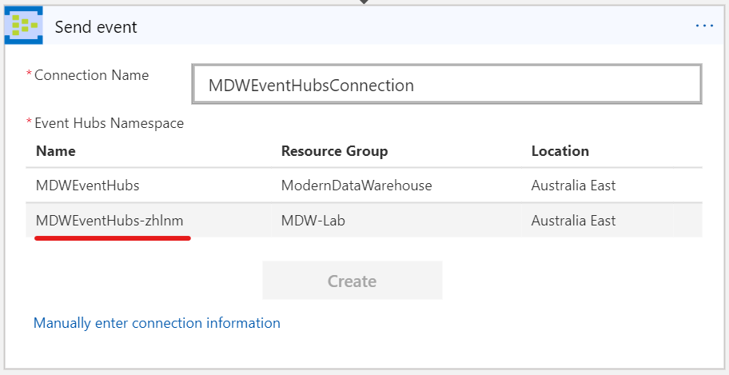

30.	On the **Send event** properties, select **nyctweets** in the **Event Hub name** field.

31.	Click **Add new parameter** and select **Content**.

32.	Click on the **Content** field. From the **Dynamic content** pop-up window, select click the **See more** link under **Compose** to display the **Outputs** field. 

33.	Select **Outputs** as the value for the **Content** field.

    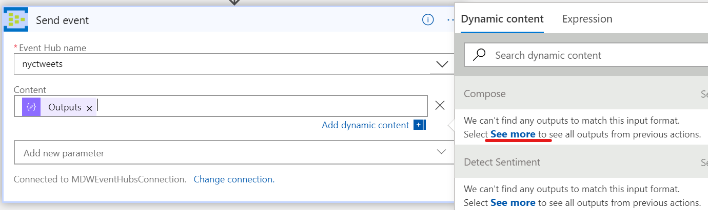

34.	Click the **Save** button to save your Logic App.

    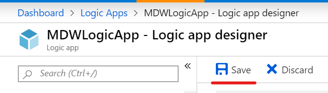

35.	On the **Overview** panel, click **Enable**.

    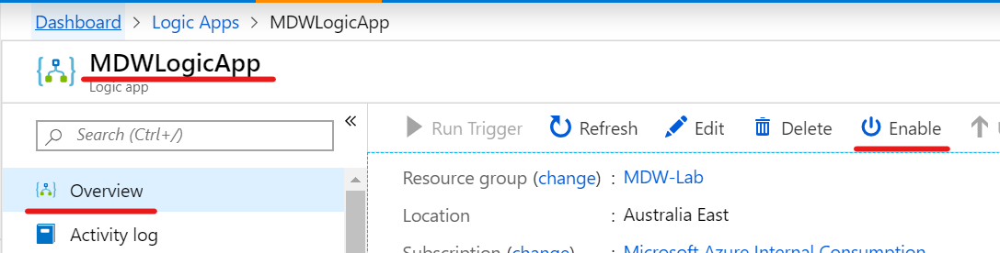

36.	In the Azure Portal, navigate to the **MDWDataLake*suffix*** storage account. 

37.	Wait a couple of minutes and you should be able to see new files being created in the **nyctweets** container. 

    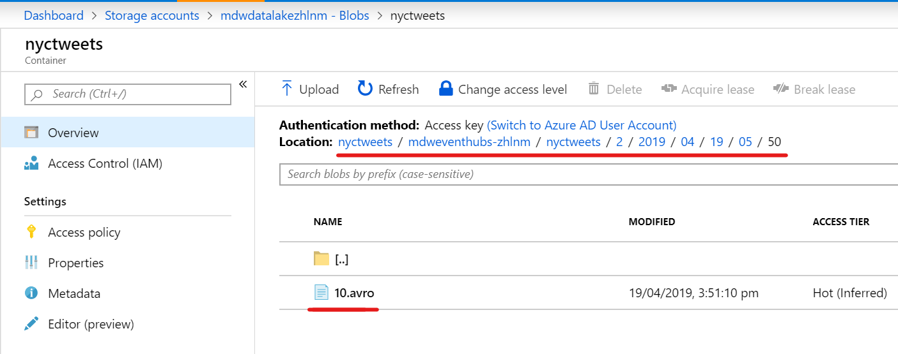

## Create and Configure Stream Analytics
In this section you will configure Stream Analytics to perform analytic queries on streaming data sent by Event Hubs and generate outputs to Power BI.


**IMPORTANT**|
-------------|
**Execute these steps on your host computer**|

1.	In the Azure Portal, go to the lab resource group and locate the Stream Analytics resource **MDWStreamAnalytics-*suffix***. 

2.	On the Inputs panel, click **+ Add stream** input button and select **Event Hub** to create a new stream input.

    

3.	On the Event Hub New input blade enter the following details:
    <br>- **Input alias**: MDWEventHubs
    <br>- **Event Hub namespace**: MDWEventHubs-suffix
    <br>- **Event hub name > Use existing**: nyctweets

4.	Leave remaining fields with their default values.

    

5.	On the **Outputs** panel, click **+ Add** button and select **Power BI** to create a new stream output.

    

6.	On the Power BI New Output blade, click Authorize to authenticate with Power BI. 
7.	Once authenticated, enter the following details:
    <br>- **Output alias**: PBITweetDetails
    <br>- **Group Workspace**: My Workspace
    <br>- **Dataset name**: NYCTweetStats
    <br>- **Table name**: TweetDetails

8.	Leave remaining fields with their default values.

9.	Click **Save**.

    

10.	Repeat the process to create another Power BI Output. This time enter the following details:
    <br>- **Output alias**: PBITweetStats
    <br>- **Group Workspace**: My Workspace
    <br>- **Dataset name**: NYCTweetStats
    <br>- **Table name**: TweetStats

11.	Click **Save**.

    

12.	On the **Query** panel, note the inputs and outputs you created in the previous steps. 

    

13.	Enter the following SQL commands in the query window.

```sql
SELECT count(*) as TotalTweets
    , avg(SentimentScore) as AverageSentiment
INTO PBITweetStats
FROM MDWEventHubs TIMESTAMP BY CreatedAt
GROUP BY HoppingWindow(second,60,5)

SELECT CreatedAt
    , TweetText
    , SentimentScore
INTO PBITweetDetails
FROM MDWEventHubs TIMESTAMP BY CreatedAt

```

14.	Click Save.

15.	On the **Overview** panel, click **Start** to start the Stream Analytics job.

    

# Create Power BI Dashboard to Visualise Real-Time Data
In this section you will log on to the Power BI portal to create a dashboard to visualize real-time Tweeter statistics data sent by Stream Analytics.


**IMPORTANT**|
-------------|
**Execute these steps on your host computer**|

1.	Open a new browser tab and navigate to https://www.powerbi.com
2.	Enter your credentials to authenticate with the Power BI service.

    

3.	Once authenticated, open the **Workspaces** menu and click **My Workspace** at the top of the Workspaces list.

    

4.	Navigate to the **Datasets** tab and verify that two datasets have been created by Stream Analytics: **NYCTweetDetails** and **NYCTweetStats**.

    

5.	On the top right-hand side corner click **+ Create** and then click **Dashboard** from the dropdown menu to create a new dashboard.

    

6.	Type “NYC Tweet Stats” in the **Dashboard name** field and click **Create**.

7.	Click **+ Add tile** button on the toolbar. 

8.	On the **Add tile** blade, select **Custom Streaming Data** under the **Real-Time Data** section.

9.	Click **Next**.

    

10.	On the **Add a custom streaming data tile** blade, select the **NYCTweetStats** dataset.

11.	Click **Next**.

    

12.	On the **Visualization Type** field select **Card**.

13.	On the **Fields** field select **totaltweets**.

14.	Click **Next**.

    

15.	On the **Tile details** blade, enter the following details:
    <br>- **Title**: Total Tweets
    <br>- **Subtitle**: in the last minute.

16.	Leave remaining fields with their default values.

17.	Click **Apply**.

    

18.	Repeat the process to create another tile, this time to display the average sentiment score. Use the following details:
    <br>- **Dataset**: NYCTweetStats
    <br>- **Visualization Type**: Card
    <br>- **Fields**: averagesentiment
    <br>- **Data Label > Value decimal places**: 3
    <br>- **Details > Display Title and Subtitle**: Checked
    <br>- **Details > Title**: Average Sentiment Score
    <br>- **Details > Subtitle**: in the last minute

    

19.	You should be able to see the values for both tiles changing every few seconds. 

20.	Try logging on to Tweeter and posting different messages with the hashtag **#NYC**. Go back to your Power BI dashboard and see the effect your messages had on the average sentiment score.

    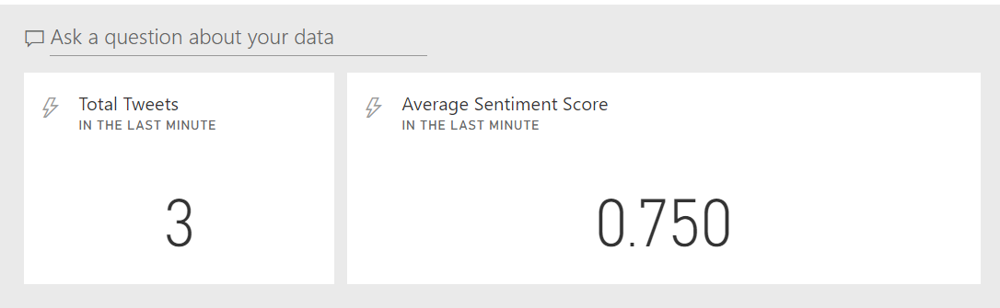

# Create Power BI Report to Visualise Real-Time Data
In this section you will log on to the Power BI portal to create a dashboard to visualize real-time Tweeter details data sent by Stream Analytics.

**IMPORTANT**|
-------------|
**Execute these steps on your host computer**|

1.	On the Power BI portal navigate to **My Workspace** and click on the **Datasets** tab again.

2.	Click on the **Create Report** icon under **Actions** for the **NYCTweetDetails** dataset.

    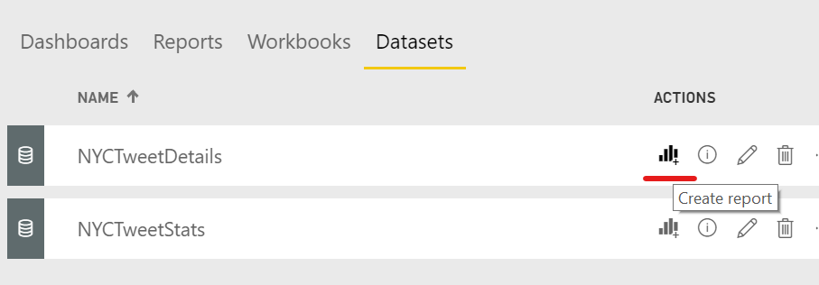

3.	On the report canvas add a **Table** visual and add the following dataset fields to the **Values** property:
    <br>- createdat
    <br>- tweettext
    <br>- sentimentscore

4.	Change the default aggregation function for **sentimentscore** to **Average**.

    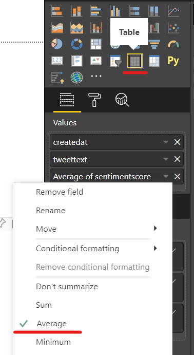

5.	On the report canvas add a **Line** chart visual and add the following dataset fields:
    <br>- **Axis**: createdat
    <br>- **Values**: sentimentscore

6.	Change the default aggregation function for **sentimentscore** to **Average**.

    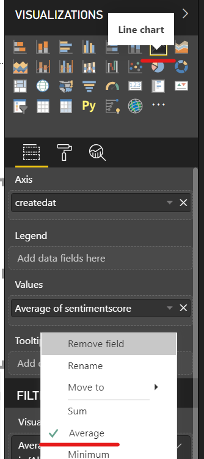

7.	On the report canvas add a **Card** visual and add the following dataset fields to its **Fields** property:
    <br>- tweettext

8.	Change the default aggregation function for **tweettext** to **Count**.

    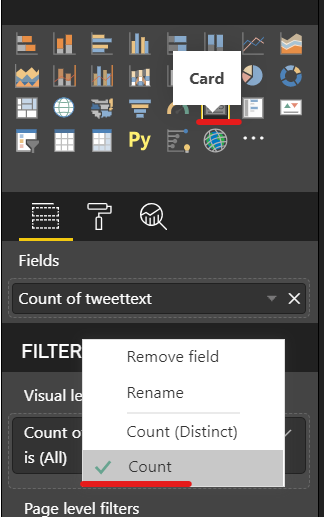

9.	On the report canvas add a **Card** visual and add the following dataset fields to its **Fields** property:
    <br>- sentimentscore

10.	Change the default aggregation function for **sentimentscore** to **Average**.

    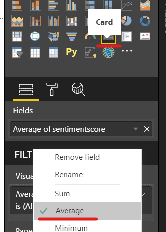

11.	Place your visuals in a way you can see all of them.

    

12.	Click the Save button on the toolbar to save your report. 

13.	Type “NYC Tweet Details” in the Report name field.
