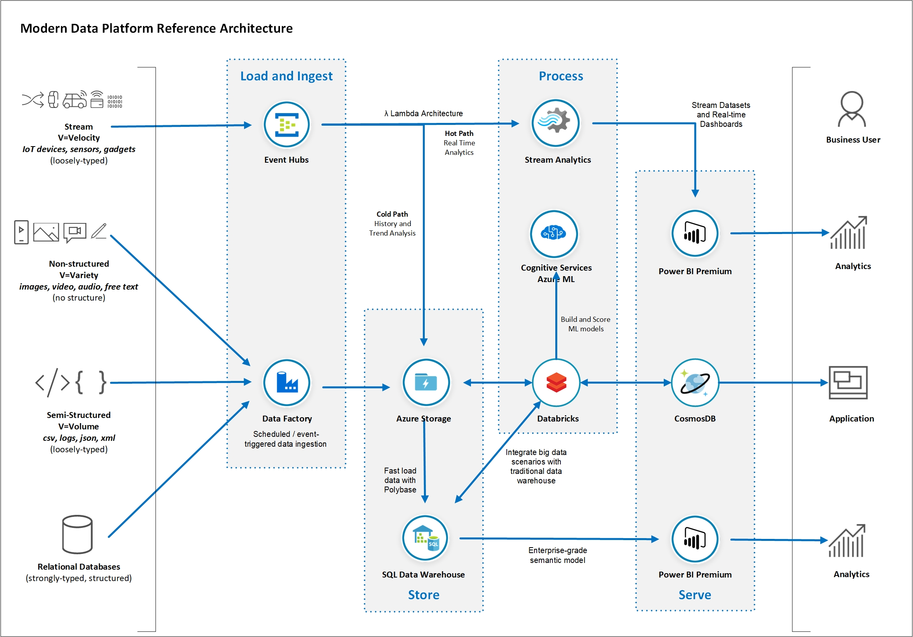
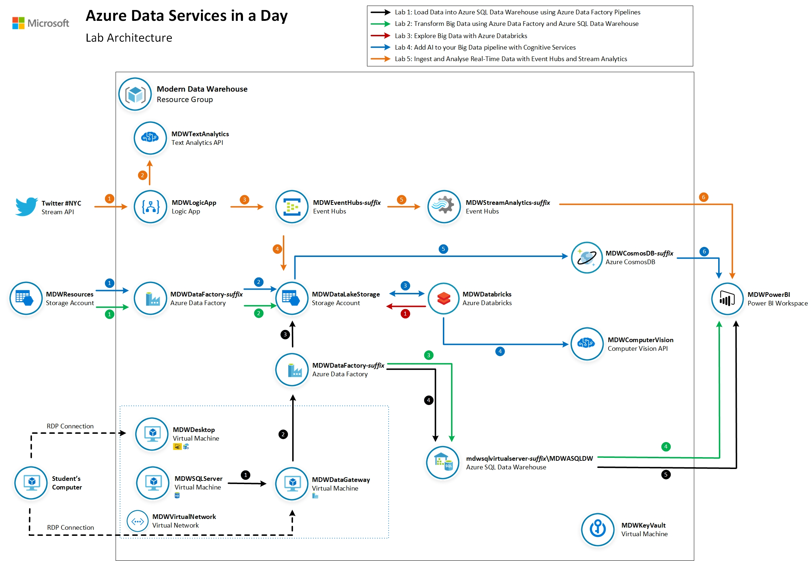
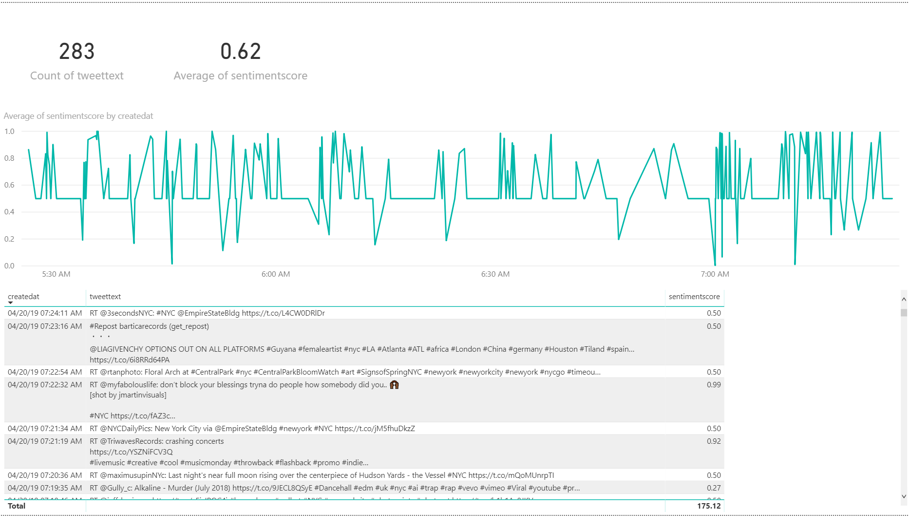

# Azure Data Platform End2End

In this workshop you will learn about the main concepts related to advanced analytics and Big Data processing and how Azure Data Services can be used to implement a modern data warehouse architecture. You will understand what Azure services you can leverage to establish a solid data platform to quickly ingest, process and visualise data from a large variety of data sources. The reference architecture you will build as part of this exercise has been proven to give you the flexibility and scalability to grow and handle large volumes of data and keep an optimal level of performance.
In the exercises in this lab you will build data pipelines using data related to New York City. The workshop was designed to progressively implement an extended modern data platform architecture starting from a traditional relational data pipeline. Then we introduce big data scenarios with large files and distributed computing. We add non-structured data and AI into the mix and finish with real-time streaming analytics. You will have done all of that by the end of the workshop.

**IMPORTANT**:

* The reference architecture proposed in this workshop aims to explain just enough of the role of each of the Azure Data Services included in the overall modern data platform architecture. This workshop does not replace the need of in-depth training on each Azure service covered.

* The services covered in this course are only a subset of a much larger family of Azure services. Similar outcomes can be achieved by leveraging other services and/or features not covered by this workshop. Specific business requirements may also ask for the use of different services or features not included in this workshop.

* Some concepts presented in this course can be quite complex and you may need to seek for more information from different sources.

## Document Structure
This document contains detailed step-by-step instructions on how to implement a Modern Data Platform architecture using Azure Data Services. It’s recommended you carefully read the detailed description contained in this document for a successful experience with all Azure services. 

You will see the label **IMPORTANT** whenever a there is a critical step to the lab. Please pay close attention to the instructions given.

You will also see the label **IMPORTANT** at the beginning of each lab section. As some instructions need to be execute on your host computer while others need to be executed in a remote desktop connection (RDP), this **IMPORTANT** label states where you should execute the lab section. See example below:

**IMPORTANT**|
-------------|
**Execute these steps on your host computer**|

## Data Source References
New York City data used in this lab was obtained from the New York City Open Data website: https://opendata.cityofnewyork.us/. The following datasets were used:
     - NYPD Motor Vehicle Collisions: https://data.cityofnewyork.us/Public-Safety/NYPD-Motor-Vehicle-Collisions/h9gi-nx95
     - TLC Yellow Taxi Trip Data: https://www1.nyc.gov/site/tlc/about/tlc-trip-record-data.page

## Lab Prerequisites and Deployment
The following prerequisites must be completed before you start these labs:

* You must be connected to the internet;

* Use either Edge or Chrome when executing the labs. Internet Explorer may have issues when rendering the UI for specific Azure services.

* You must have a Pay-As-You-Go Azure account with administrator- or contributor-level access to your subscription. If you don’t have an account, you can sign up for an account following the instructions here: https://azure.microsoft.com/en-au/pricing/purchase-options/pay-as-you-go/. 

     **IMPORTANT**: Azure free subscriptions have quota restrictions that prevent the workshop resources from being deployed successfully. Please use a Pay-As-You-Go subscription instead.

     **IMPORTANT**: When you deploy the lab resources in your own subscription you are responsible for the charges related to the use of the services provisioned. For more information about the list of services and tips on how to save money when executing these labs, please visit the Cost Management section of the [Lab 0: Deploy Azure Data Platform End2End to your subscription](./Deploy/Deploy.md) page.

* Lab 1 requires you to open a Remote Desktop Connection (RDP) to Azure Virtual Machines. If you are using a Mac, please ensure you have the latest version of the Microsoft Remote Desktop software installed: https://apps.apple.com/us/app/microsoft-remote-desktop-10/id1295203466?mt=12

* Lab 5 requires you to have a Twitter account. If you don’t have an account you can sign up for free following the instructions here: https://twitter.com/signup. 

* Lab 5 requires you to have a Power BI Pro account. If you don’t have an account you can sign up for a 60-day trial for free here: https://powerbi.microsoft.com/en-us/power-bi-pro/
  
## Lab Guide

Throughout a series of 5 labs you will progressively implement a modern data platform architecture using datasets from New York City. 

You will start ingesting relational data about traffic collisions in Manhattan hosted by SQL Server in your Azure SQL Data Warehouse. Then we will introduce the concepts of data lake and  big data challenges and you will put then to practice by ingesting and processing over 100 million yellow taxi ride records stored as large data files stored in your data lake.

You will then have use Databricks and the power of Spark clusters to explore big data files. Then you will incorporate AI into your data pipeline by invoking Cognitive Services Computer Vision API to automatically generate metadata for New York City street photographies and store them in a Cosmos DB database. Finally, you will use the Twitter hashtag #NYC as a source of streaming events that you will capture, store and process in real time with Event Hubs, Stream Analytics and Power BI.

By the end of the workshop you will have implementd the lab architecture referenced below:

### [Lab 0: Deploy Azure Data Platform End2End to your subscription](./Deploy/Deploy.md)

**IMPORTANT**: You should skip this Lab if you are executing the labs through subscriptions provided by CloudLabs. All Azure services will be deployed as you activate your registration.

In this section you will automatically provision all Azure resources required to complete labs 1 though to 5. We will use a pre-defined ARM template with the definition of all Azure services used to ingest, store, process and visualise data. 

The estimated time to complete this lab is: **30 minutes**.

**IMPORTANT**|
-------------|
**In order to avoid potential delays caused by issues found during the ARM template deployment it is recommended you execute Lab 0 prior to Day 1.**|

### [Lab 1: Load Data into Azure SQL Data Warehouse using Azure Data Factory Pipelines](./Lab/Lab1/Lab1.md)

In this lab you will configure the Azure environment to allow relational data to be transferred from a SQL Server 2017 database to an Azure SQL Data Warehouse database using Azure Data Factory. The dataset you will use contains data about motor vehicle collisions that happened in New York City from 2012 to 2019. You will use Power BI to visualise collision data loaded from Azure SQL Data Warehouse.

The estimated time to complete this lab is: **75 minutes**.

Step     | Description
-------- | -----
 | Restore SQL Server backup from Azure Storage and Configure Azure Data Factory Self-Hosted Integration Runtime
 | Build an Azure Data Factory Pipeline to copy data from a SQL Server table
 | Use Azure Storage as a staging area for Polybase
 | Load data to an Azure SQL Data Warehouse table using Polybase
 | Visualize data from Azure SQL Data Warehouse using Power BI

### [Lab 2: Transform Big Data using Azure Data Factory and Azure SQL Data Warehouse](./Lab/Lab2/Lab2.md)
In this lab you will use Azure Data Factory to download large data files into your data lake and use an Azure SQL Data Warehouse stored procedure to generate a summary dataset and store it in the final table. The dataset you will use contains detailed New York City Yellow Taxi rides for 2018. You will generate a daily aggregated summary of all rides and save the result in your data warehouse. You will then use Power BI to visualise summarised data. 

The estimated time to complete this lab is: **60 minutes**.

 
Step     | Description
-------- | -----
 | Build an Azure Data Factory Pipeline to copy big data files from shared Azure Storage
 | Save data files to your data lake
 | Use Polybase to load data into staging tables in your Azure SQL Data Warehouse. Call a Stored Procedure to perform data aggregations and save results in the final table.
 | Visualize data from your Azure SQL Data Warehouse using Power BI

### [Lab 3: Explore Big Data using Azure Databricks](./Lab/Lab3/Lab3.md)
In this lab you will use Azure Databricks to explore the New York Taxi data files you saved in your data lake in Lab 2. Using a Databricks notebook you will connect to the data lake and query taxi ride details. 

The estimated time to complete this lab is: **45 minutes**.

Step     | Description
-------- | -----
 |Build an Azure Databricks notebook to explore the data files you saved in your data lake in the previous exercise. You will use Python and SQL commands to open a connection to your data lake and query data from data files.

### [Lab 4: Add AI to your Big Data Pipeline with Cognitive Services](./Lab/Lab4/Lab4.md)
In this lab you will use Azure Data Factory to download New York City images to your data lake. Then, as part of the same pipeline, you are going to use an Azure Databricks notebook to invoke Computer Vision Cognitive Service to generate metadata documents and save them in back in your data lake. The Azure Data Factory pipeline then finishes by saving all metadata information in a Cosmos DB collection. You will use Power BI to visualise NYC images and their AI-generated metadata.

The estimated time to complete this lab is: **75 minutes**.

Step     | Description
-------- | -----
 | Build an Azure Data Factory Pipeline to copy image files from shared Azure Storage
 | Save image files to your data lake
 | For each image in your data lake, invoke an Azure Databricks notebook that will take the image URL as parameter
 | For each image call the Azure Computer Vision Cognitive service to generate image metadata. Metadata files are saved back in your data lake
 | Copy metadata JSON documents into your Cosmos DB database
 | Visualize images and associated metadata using Power BI

### [Lab 5: Ingest and Analyse real-time data with Event Hubs and Stream Analytics](./Lab/Lab5/Lab5.md)
In this lab you will use an Azure Logic App to connect to Twitter and generate a stream of messages using the hashtag #NYC. The logic app will invoke the Azure Text Analytics Cognitive service to score Tweet sentiment and send the messages to Event Hubs. You will use Stream Analytics to generate the average Tweet sentiment in the last 60 seconds and send the results to a real-time dataset in Power BI.

The estimated time to complete this lab is: **75 minutes**.

Step     | Description
-------- | -----
 | Build an Azure Logic App to invoke the Twitter API and retrieve Tweets with the hashtag #NYC
 | For each Tweet, invoke the Azure Text Analytics Cognitive service to detect its sentiment score
 | Format and send the Tweet’s JSON message to Event Hubs
 | Save Tweet messages into your data lake for future analysis (cold path)
 | Send stream of Tweet messages to Stream Analytics for real-time analytics (hot path)
 | Visualize real-time data generated by Stream Analytics with Power BI

## Workshop Proposed Agenda

### **1-Day Format**

Activity | Duration
-------- | ---------
Workshop Overview | 15 minutes
Modern Data Platform Concepts: Part I | 15 minutes
**Modern Data Warehousing** |
Lab 1: Load Data into Azure SQL Data Warehouse using Azure Data Factory Pipelines    | 75 minutes
Modern Data Platform Concepts: Part II | 15 minutes
Lab 2: Transform Big Data using Azure Data Factory and Azure SQL Data Warehouse    | 60 minutes
**Advanced Analytics** |
Modern Data Platform Concepts: Part III | 15 minutes
Lab 3: Explore Big Data using Azure Databricks    | 45 minutes
Modern Data Platform Concepts: Part IV | 15 minutes
Lab 4: Add AI to your Big Data Pipeline with Cognitive Services    | 75 minutes
**Real-time Analytics** |
Modern Data Platform Concepts: Part V | 15 minutes
Lab 5: Ingest and Analyse real-time data with Event Hubs and Stream Analytics   | 75 minutes

### **2-Day Format**

The workshop content will be delivered over the course of two days with the following agenda:

### **Day 1**

Activity | Duration
-------- | ---------
Workshop Overview | 45 minutes
Lab 0: Deploy Azure Data Platform End2End to your subscription * | 30 minutes
Modern Data Platform Concepts: Part I | 90 minutes
**Modern Data Warehousing** |
Lab 1: Load Data into Azure SQL Data Warehouse using Azure Data Factory Pipelines    | 75 minutes
Modern Data Platform Concepts: Part II | 90 minutes
Lab 2: Transform Big Data using Azure Data Factory and Azure SQL Data Warehouse    | 60 minutes

\* Lab 0 preferable done before Day 1.

### **Day 2**

Activity | Duration
-------- | ---------
**Advanced Analytics** |
Modern Data Platform Concepts: Part III | 60 minutes
Lab 3: Explore Big Data using Azure Databricks    | 45 minutes
Modern Data Platform Concepts: Part IV | 60 minutes
Lab 4: Add AI to your Big Data Pipeline with Cognitive Services    | 75 minutes
**Real-time Analytics** |
Modern Data Platform Concepts: Part V | 60 minutes
Lab 5: Ingest and Analyse real-time data with Event Hubs and Stream Analytics   | 75 minutes